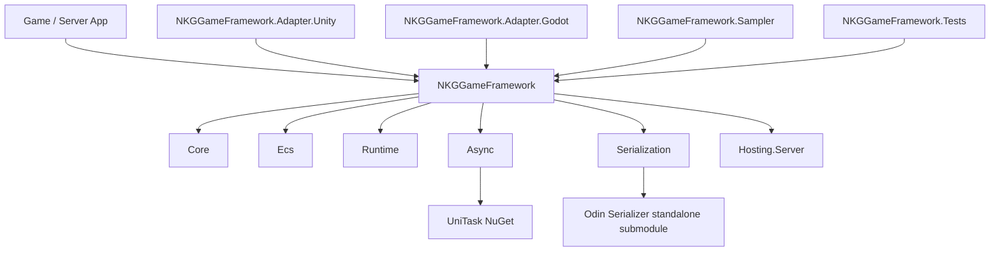
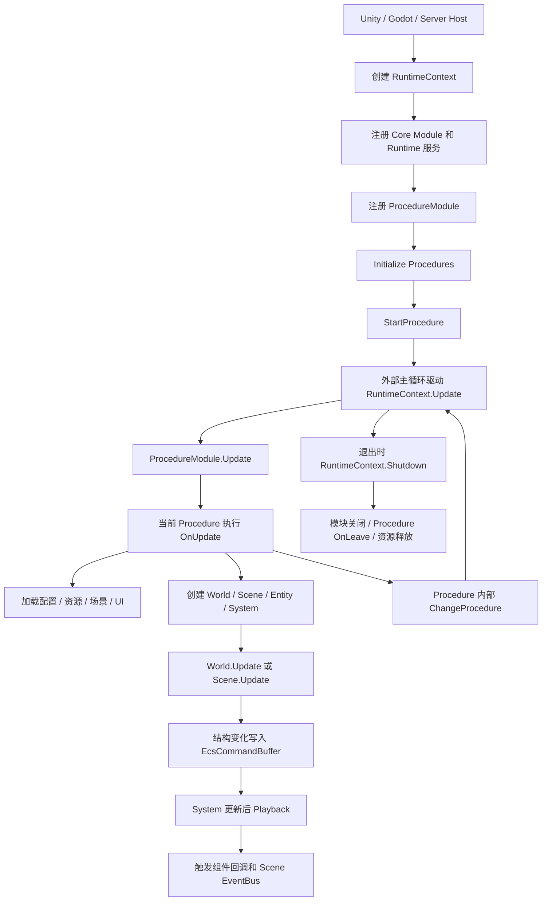

# NKGGameFramework

NKGGameFramework 是一个不依赖具体游戏引擎的 C# 游戏框架底层。核心运行时、模块系统、事件、池化、ECS、资源/场景抽象、异步和序列化都放在纯 .NET 层；Unity、Godot 或 Server 只通过 Adapter/Hosting 接入。

当前工程基于 .NET 10，主框架保持单包集成，方便业务侧直接引用。

## 能力范围

- `Core`：模块、事件、对象池、内存池、FSM/Procedure、Timer、RuntimeContext。
- `Ecs`：World/Scene 隔离、EntityRef 版本校验、typed query、CommandBuffer、System 生命周期、组件结构变化回调。
- `Runtime`：Asset、Scene、Audio、UI、Config、Localization、Presentation 等引擎无关接口。
- `Async`：基于 Cysharp UniTask，统一 Runtime 异步契约和 `GameAsync` 创建/组合入口。
- `Serialization`：基于 Odin Serializer standalone，提供通用字符串、二进制和 JSON 序列化接口。
- `Adapter`：Unity/Godot 边界项目只定义接入契约，不让主框架反向依赖具体引擎。
- `Sampler`：完整演示从启动、加载、玩法、存档到退出的流程。

## 项目结构



主包 `NKGGameFramework` 是业务集成入口。Adapter 只能依赖主包，主包不能依赖 Unity/Godot/YooAsset/HybridCLR/Luban 等引擎或生成管线依赖。

## 游戏生命周期



事件系统提供两种派发方式：

- `Publish` / `FireNow`：立即派发，适合 ECS 生命周期事件和需要同步完成的框架事件。
- `Fire`：入队派发，由 `RuntimeContext.Update` 或 `Scene.Update` 在帧末尾处理，适合业务事件解耦。

热路径事件可以继承 `GameEventArgs`，通过 `Rent` / `Return` 或 `FirePooled` 复用事件参数对象。

ProcedureModule 是游戏主流程状态机管理器，负责把启动、登录、加载、玩法、退出等阶段串起来：

```csharp
using var context = new RuntimeContext();

var procedures = context.RegisterModule(new ProcedureModule());
procedures.Initialize(
    new BootProcedure(),
    new LoginProcedure(),
    new GameplayProcedure(),
    new ShutdownProcedure());

procedures.StartProcedure<BootProcedure>();

while (running)
{
    context.Update(deltaTime, realDeltaTime);
}

context.Shutdown();
```

流程切换发生在具体 Procedure 内部：

```csharp
public sealed class BootProcedure : ProcedureBase
{
    protected override void OnUpdate(Fsm<IProcedureModule> procedureOwner, double deltaTime, double realDeltaTime)
    {
        ChangeProcedure<LoginProcedure>(procedureOwner);
    }
}
```

Gameplay Procedure 中可以创建 ECS 世界并驱动业务逻辑：

```csharp
var scene = new Scene("battle");
scene.Systems.Add(new MovementSystem());

var unit = scene.CreateEntity()
    .Add(new Position(0, 0))
    .Add(new Velocity(2, 3));

scene.Update(0.5, 0.5);
```

Runtime 异步接口统一使用 `UniTask` / `UniTask<T>`：

```csharp
public interface IAssetService
{
    UniTask<IAssetHandle<TAsset>> LoadAsync<TAsset>(
        string location,
        CancellationToken cancellationToken = default)
        where TAsset : class;
}
```

通用序列化默认使用 `OdinGameSerializer`：

- `IBinaryGameSerializer`：直接读写 `byte[]` payload。
- `IJsonGameSerializer`：直接读写 Odin JSON 文本 payload。
- `IGameSerializer`：字符串接口；默认使用 Base64 承载 Odin 二进制数据，构造为 `DataFormat.JSON` 时直接读写 Odin JSON 文本。
- 默认使用 `SerializationPolicies.Everything`，支持无 attribute 的私有字段、复杂对象和多态引用。

## 构建验证

```powershell
git submodule update --init --recursive
dotnet test .\NKGGameFramework.sln
dotnet run --project .\samples\NKGGameFramework.Sampler\NKGGameFramework.Sampler.csproj
.\eng\verify-engine-independence.ps1
```

如果本机默认 `dotnet` 不是 .NET 10 SDK，请使用已安装的 .NET 10 SDK 路径运行同一命令。

更多设计说明见 `docs/architecture.md`，参考分析见 `docs/reference-analysis.md`。
