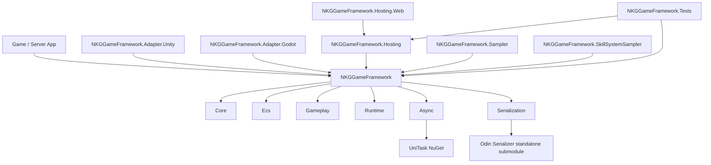
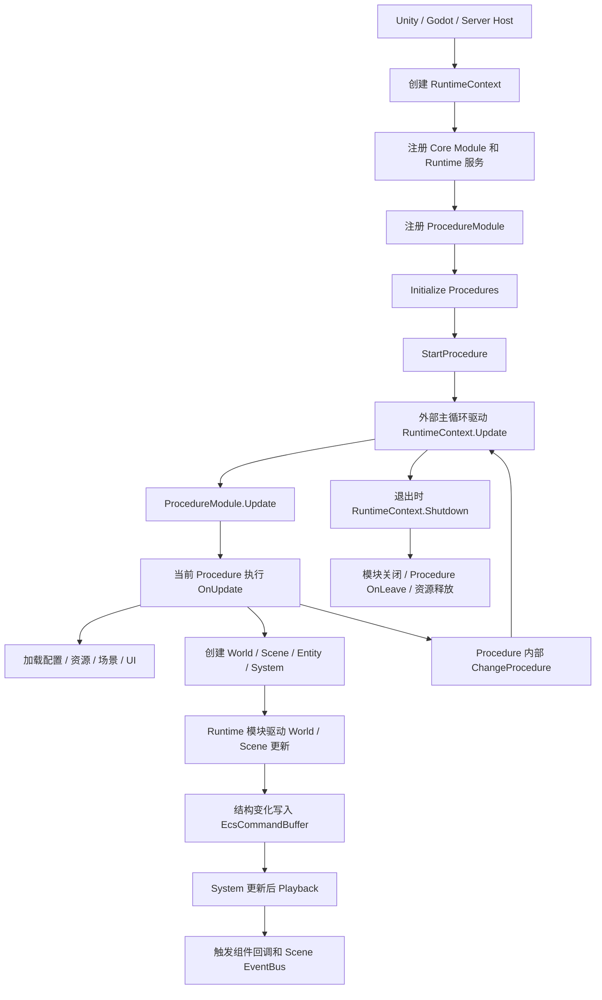

# NKGGameFramework

NKGGameFramework 是一个不依赖具体游戏引擎的 C# 游戏框架底层。核心运行时、模块系统、事件、池化、ECS、资源/场景抽象、异步和序列化都放在纯 .NET 层；Unity、Godot、Server 或 Web Debug Host 只通过 Adapter/Hosting 接入。

当前工程基于 .NET 10，主框架保持纯核心包，Hosting 和 Adapter 独立引用核心包，方便业务侧按需接入。

## 能力范围

- `Core`：模块、事件、对象池、内存池、FSM/Procedure、Timer、RuntimeContext。
- `Ecs`：World/Scene 隔离、EntityRef 版本校验、typed query、CommandBuffer、System 生命周期、组件结构变化回调。
- `Gameplay`：引擎无关 GameplayTag、行为树、Skill/Buff 运行时，包含 UE 风格层级标签、事件驱动行为树、技能书、CD、技能效果、Buff 叠层/刷新/生命周期和 ECS 更新系统。
- `Runtime`：Asset、Scene、Audio、UI、Config、Localization、Presentation 等引擎无关接口。
- `Runtime.MVVM`：ViewModel、可绑定值、BindingSet 和 UI adapter 可接入的绑定目标。
- `Async`：基于 Cysharp UniTask，统一 Runtime 异步契约和 `GameAsync` 创建/组合入口。
- `Serialization`：基于 Odin Serializer standalone，提供通用字符串、二进制和 JSON 序列化接口。
- `Adapter`：Unity/Godot 边界项目只定义接入契约，不让主框架反向依赖具体引擎。
- `Hosting`：框架自带的轻量本地 Debug Host，提供 ECS/Procedure/Skill/Buff 快照 API；React 面板单独放在 `NKGGameFramework.Hosting.Web`。
- `Sampler`：完整演示从启动、加载、玩法、存档到退出的流程。
- `SkillSystemSampler`：专门演示 Skill/Buff/BehaviorTree 的组合运行。

## 项目结构



主包 `NKGGameFramework` 是业务集成入口。Adapter/Hosting 只能依赖主包，主包不能依赖 Unity/Godot/YooAsset/HybridCLR/Luban/React 等引擎、宿主或工具链依赖。

## 游戏生命周期



事件系统提供两种派发方式：

- `Publish` / `FireNow`：立即派发，适合 ECS 生命周期事件和需要同步完成的框架事件。
- `Fire`：入队派发，由 `RuntimeContext.Update` 或 `Scene.Update` 在帧末尾处理，适合业务事件解耦。

热路径事件可以继承 `GameEventArgs`，通过 `Rent` / `Return` 或 `FirePooled` 复用事件参数对象。

ProcedureModule 是游戏主流程状态机管理器，负责把启动、登录、加载、玩法、退出等阶段串起来：

```csharp
using var context = new RuntimeContext();

var procedures = context.RegisterModule(new ProcedureModule());
procedures.Initialize(
    new BootProcedure(),
    new LoginProcedure(),
    new GameplayProcedure(),
    new ShutdownProcedure());

procedures.StartProcedure<BootProcedure>();

var time = GameFrameTime.Zero;
while (running)
{
    time = GameFrameTime.Advance(time, deltaTime, realDeltaTime);
    context.Update(in time);
}

context.Shutdown();
```

流程切换发生在具体 Procedure 内部：

```csharp
public sealed class BootProcedure : ProcedureBase
{
    protected override void OnUpdate(Fsm<IProcedureModule> procedureOwner, in GameFrameTime time)
    {
        ChangeProcedure<LoginProcedure>(procedureOwner);
    }
}
```

Gameplay Procedure 中可以创建 ECS 世界并驱动业务逻辑：

```csharp
var scene = new Scene("battle");
scene.Systems.Add(new MovementSystem());

var unit = scene.CreateEntity()
    .Add(new Position(0, 0))
    .Add(new Velocity(2, 3));

var frameTime = GameFrameTime.FromSeconds(0.5, 0.5, frame: 1);
scene.Update(in frameTime);
```

Gameplay 层提供从 `NKGMobaBasedOnET` 技能/Buff 架构抽取出的通用运行时模型：

- `GameplayTag` / `GameplayTagContainer` / `GameplayTagQuery`：从 UE GameplayTags 抽取的层级标签、容器匹配、批量容器操作和查询表达式语义。
- `IGameplayTagAsset` / `EntityGameplayTagAsset`：对齐 UE `IGameplayTagAssetInterface` 的 owned tags 查询语义。
- `GameplayTagRegistry` / `GameplayTagConfigParser` / `GameplayTagTableParser`：支持标签注册、DevComment/source 元数据、redirect、父子查询、UE `GameplayTagList` / `RestrictedGameplayTagList` / `GameplayTagRedirects` 配置条目解析，以及 GameplayTag DataTable CSV 导入。
- `BehaviorTreeDefinition` / `BehaviorTreeInstance`：从 NKGMoba NPBehave 抽取并优化的引擎无关行为树，支持 Sequence、Selector、Parallel、Wait、Action、Repeater、黑板条件和事件驱动重评估。
- `BehaviorBlackboard` / `BehaviorActionRegistry`：黑板值变化会触发 observer 并进入执行队列；动画、特效、音效、Buff、伤害等具体动作通过 action registry 注册，不进入主包。
- `BuffDefinition` / `BuffInstance`：描述 Buff 数据、目标、层数、持续时间、刷新策略和运行状态。
- `BuffManager` / `BuffUpdateSystem`：负责添加、刷新、移除和按 ECS 帧推进 Buff 生命周期。
- `SkillDefinition` / `SkillBookComponent`：描述技能展示信息、等级、CD、消耗和效果列表。
- `SkillManager` / `SkillCooldownSystem`：负责学习技能、释放校验、执行技能效果和 CD 推进。

技能可以继续通过 `SkillEffectRegistry` 同步执行效果，也可以通过 `SkillDefinition.ExecutionTree` 启动行为树流程。默认行为树 action `apply_buff` 可以把技能节点连接到 Buff 系统；Unity/Godot 特效、动画、材质变化等引擎相关行为应通过 `BehaviorActionRegistry` 在 Adapter 或业务层注册，不进入主包。Buff 也可通过 `BuffDefinition.ExecutionTree` 在生命周期内运行行为树，同时保留 `BuffEffectRegistry` apply/refresh/update/remove 扩展点。

Skill/Buff 定义支持 `Required*Tags` / `Blocked*Tags` gate，也支持 `GameplayTagQuery` 复合条件。实体可通过 `GameplayTagComponent` 持有基础标签，激活中的 Buff 也会向实体贡献 `BuffDefinition.Tags`，用于沉默、免疫、元素状态、阵营、职业等通用判定。

## Web Debug Inspector

调试链路包含：

- `GameDebugRuntimeRegistry`：主框架自动跟踪当前进程内创建的 `RuntimeContext` 和 `World`，Web Debug 默认从这里发现可调试运行态。
- `GameDebugHost`：框架自带的本地 Debug Host，启动轻量 loopback HTTP/SSE transport，并直接暴露 Web Debug 所需的 `/_nkg/debug/*` API。
- `GameDebugSession`：注册需要观察的 `RuntimeContext` 和 `World`。
- `GameDebugSnapshotProvider`：生成包含 modules、procedures、worlds、scenes、systems、entities、components、skills、buffs 的快照；组件原始值以 Odin JSON payload 导出。
- `GameDebugMutationHandler`：接收组件 Odin JSON payload，按运行时组件类型反序列化后通过 ECS set 流程写回，支持通用组件值编辑。
- `GameDebugDumpRecorder`：录制最近一段 frame snapshot window，停止时写出 `.nkgdump.json` 并可在 Web 面板 Timeline 中回放。

WebDebug 的 pause / step / frame stream 只挂在 `RuntimeContext.Update` 这一个项目入口上；`World.Update` 和 `Scene.Update` 应由 Runtime 模块在帧内推进，不作为独立调试帧出口。

完整 WebDebug、Frame Stream、Snapshot Window Dump 和后续 delta recorder 设计见 [docs/debug-and-dump.md](docs/debug-and-dump.md)。

默认 Debug Host 示例：

```csharp
using NKGGameFramework.Hosting.Diagnostics;

await using var debugHost = await GameDebugHost.StartAsync();
Console.WriteLine(debugHost.BaseAddress);
```

组件 mutation 默认关闭；本地开发需要编辑组件时显式开启：

```csharp
await using var debugHost = await GameDebugHost.StartAsync(options =>
{
    options.EnableMutations = true;
});
```

开发环境也可以通过环境变量启用框架自启动：

```powershell
$env:NKG_DEBUG_HOST = "1"
$env:NKG_DEBUG_HOST_URL = "http://127.0.0.1:5057"
$env:NKG_DEBUG_HOST_MUTATIONS = "1"
```

React 面板位于 `src/NKGGameFramework.Hosting.Web`，开发模式默认请求同源 `/_nkg/debug/snapshot`、`/_nkg/debug/stream`、`/_nkg/debug/control`、`/_nkg/debug/mutations` 和 `/_nkg/debug/dump/recording`，也可以通过 `NKG_DEBUG_API` 配置 Vite proxy 目标。

`GameDebugSession.Register(...)` 只用于需要显式限定调试范围的场景；默认情况下，快照接口会读取框架内置 registry 中自动发现的运行态对象。
宿主游戏只需要启动 `GameDebugHost` 或使用 `GameDebugHostAutoStart`，不需要接入额外 Web 框架。

两个 sample 都可作为 Web Debug 手动体验用例。运行后进程会持续推进 Runtime 帧，按任意键退出：

```powershell
$env:NKG_DEBUG_HOST = "1"
$env:NKG_DEBUG_HOST_URL = "http://127.0.0.1:5067"
dotnet run --project .\samples\NKGGameFramework.Sampler\NKGGameFramework.Sampler.csproj
dotnet run --project .\samples\NKGGameFramework.SkillSystemSampler\NKGGameFramework.SkillSystemSampler.csproj
```

Runtime 异步接口统一使用 `UniTask` / `UniTask<T>`：

```csharp
public interface IAssetService
{
    UniTask<IAssetHandle<TAsset>> LoadAsync<TAsset>(
        string location,
        CancellationToken cancellationToken = default)
        where TAsset : class;
}
```

通用序列化默认使用 `OdinGameSerializer`：

- `IBinaryGameSerializer`：直接读写 `byte[]` payload。
- `IJsonGameSerializer`：直接读写 Odin JSON 文本 payload。
- `IGameSerializer`：字符串接口；默认使用 Base64 承载 Odin 二进制数据，构造为 `DataFormat.JSON` 时直接读写 Odin JSON 文本。
- 默认使用 `SerializationPolicies.Everything`，支持无 attribute 的私有字段、复杂对象和多态引用。

## 构建验证

```powershell
git submodule update --init --recursive
dotnet test .\NKGGameFramework.sln
dotnet run --project .\samples\NKGGameFramework.Sampler\NKGGameFramework.Sampler.csproj
dotnet run --project .\samples\NKGGameFramework.SkillSystemSampler\NKGGameFramework.SkillSystemSampler.csproj
.\eng\verify-engine-independence.ps1
cd .\src\NKGGameFramework.Hosting.Web
npm install
npm run build
```

`NKGGameFramework.Sampler` 运行基础 Procedure/ECS/序列化演示。`NKGGameFramework.SkillSystemSampler` 运行技能系统演示：通过行为树驱动三段式火球，命中叠加灼烧 Buff，并在三层灼烧时把周期伤害切换为真实伤害。

如果本机默认 `dotnet` 不是 .NET 10 SDK，请使用已安装的 .NET 10 SDK 路径运行同一命令。

更多设计说明见 `docs/architecture.md`，参考分析见 `docs/reference-analysis.md`。
