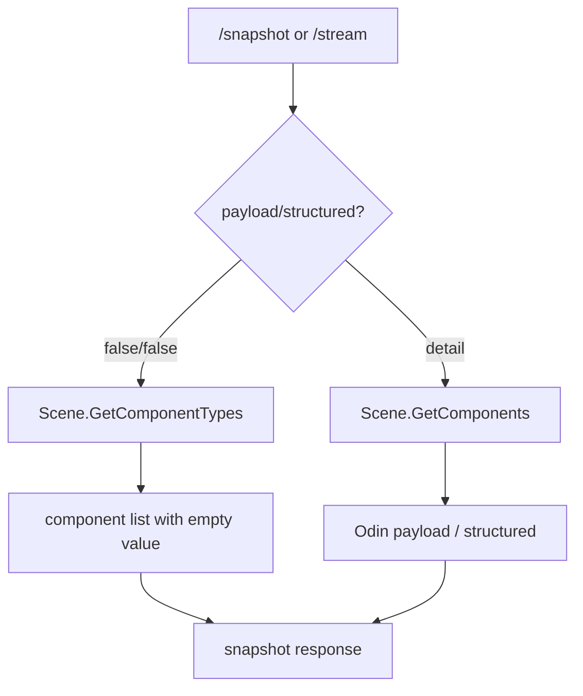
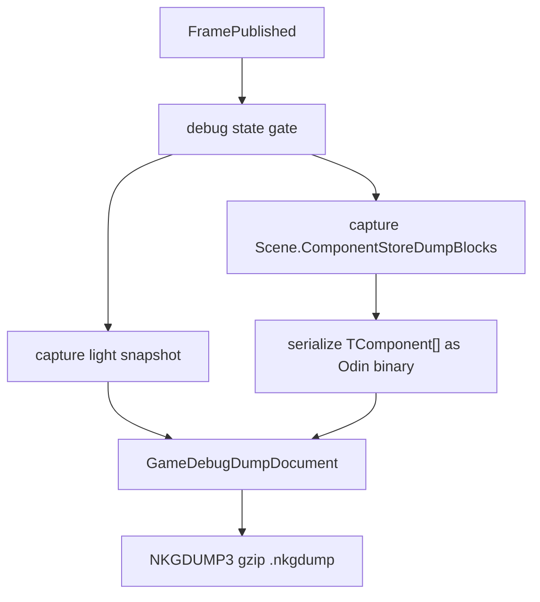

# Debug and Dump Flow

本文记录 debug 和 dump 的当前实现方案。核心原则是：实时 WebDebug 走轻量 summary + 按需 detail；dump 录制走轻量 frame + `ComponentStoreBlock` 批量 Odin 序列化；分析报告基于真实 dump 文件做归因。

## Scope

Debug 能力分三层：

- WebDebug：在线检查器，用于查看当前运行态、暂停/单步、按需查看实体组件值、编辑组件字段。
- Dump Recorder / Playback：录制 frame summary 和 ECS component store blocks，离线回放时按需 materialize 组件详情。
- Dump Analysis Report：离线分析工具，用于统计 dump 里哪些类型、字段、组件值最占空间。

三层共享框架 introspection 能力，但数据粒度不同：

- live summary 只需要组件类型、实体、系统、component store 计数等元数据。
- live detail 才需要组件 payload / structured。
- dump frame 只保存 UI 回放需要的轻量 snapshot。
- dump block 保存真实组件值，按 component store 批量存储。
- report 读取 dump block，并按需展开 structured 做字段排行。

## Terms

- `payload`：组件值的主序列化结果。live detail 使用 `odin-json`；dump 使用 store-level `odin-binary-array`。
- `structured`：组件值的树形视图，面向 WebDebug 展示、编辑、报告字段排行。
- `light snapshot`：不包含逐组件 payload / structured 的 snapshot frame。
- `ComponentStoreBlock`：一个 scene 下同一组件类型的 `entityIds + TComponent[]`。
- `materialize`：从 payload 或 block row 还原结构化预览。

debug 组件值统一使用 `GameDebugOdinSerializationPolicy`：默认只包含 public field、public auto property backing field 和显式 `[OdinSerialize]` 成员，并排除 `[NonSerialized]`。auto property 需要排除时使用 `[field: NonSerialized]` 标到 backing field。live detail、dump block、playback materialize 和 report structured 展开都遵循同一套成员缓存，避免把集合自身的 `Count`、`Comparer` 或运行时缓存字段统计进报告。

## Live Snapshot

实时 snapshot 分两种路径：

summary 路径不会对普通自定义组件做值序列化。技能书和 BUFF 这类已有摘要 UI 通过内部 entity summary provider 生成附加摘要，不参与通用组件值序列化。

detail 路径保持通用：用户新增自己的 `IComponent` 后，只要 Odin 能处理，就能在 WebDebug 里查看 structured，也能通过 mutation 写回。

## Dump Recording

录制时不再保存逐组件 snapshot payload。每个 frame 记录两部分：

1. `Frames`：轻量 `GameDebugSnapshotMessage`，用于回放时间轴和实体/组件列表。
2. `BlockFrames`：每个 world/scene/component store 的 Odin binary block。

这个设计避免了逐组件 payload 带来的重复类型信息、重复字段结构、字符串 payload 和大量临时对象。录制器也不需要知道 `SkillDefinition`、`BehaviorTreeDefinition` 或用户业务组件。默认录制保留全部帧；需要窗口化时可配置 `GameDebugOptions.MaxRecordedDumpFrames`，录制器会丢弃最旧帧并累计 `DroppedFrameCount`。

## Dump Playback

回放接口保持面向 Web UI 的形态：

- `POST /_nkg/debug/dump/playback`
- `POST /_nkg/debug/dump/playback/upload`
- `GET /_nkg/debug/dump/playback/frame`
- `GET /_nkg/debug/dump/playback/component`

frame 接口返回轻量 snapshot。组件详情接口根据 `worldName`、`sceneName`、`entityId`、`componentType` 找到对应 block，再从 `entityIds` 定位 row，反序列化数组并生成 structured。playback 会缓存最近使用的 block array，避免反复打开同一 store 时重复反序列化。

## Dump Analysis Report

分析报告工具读取真实 `.nkgdump`：

- `serializedBytes` 是文件实际大小。
- `payloadBytes` 是 block payload 保存成本。
- `structuredBytes` 是分析/预览时展开出来的结构化视图成本。
- 排行维度包括 type、field、component、entity、scene。

报告可以通过 API 获取，也可以在 Web 的 `Dump Report` dockview 里加载 dump 文件查看。

## Entry Points

- `GET /_nkg/debug/snapshot`
- `GET /_nkg/debug/stream`
- `POST /_nkg/debug/mutations`
- `GET /_nkg/debug/dump/recording`
- `POST /_nkg/debug/dump/recording`
- `POST /_nkg/debug/dump/playback`
- `POST /_nkg/debug/dump/playback/upload`
- `GET /_nkg/debug/dump/playback/frame`
- `GET /_nkg/debug/dump/playback/component`
- `POST /_nkg/debug/dump/analysis`
- `POST /_nkg/debug/dump/analysis/upload`

## Non-Goals

- 不兼容旧 dump 格式。
- 不做 temp file spool。
- 不做 frame reference table。
- 不在 gameplay 运行时做增量整合。
- 不为业务组件写特化 recorder。
- 不让 report 工具参与写盘。
