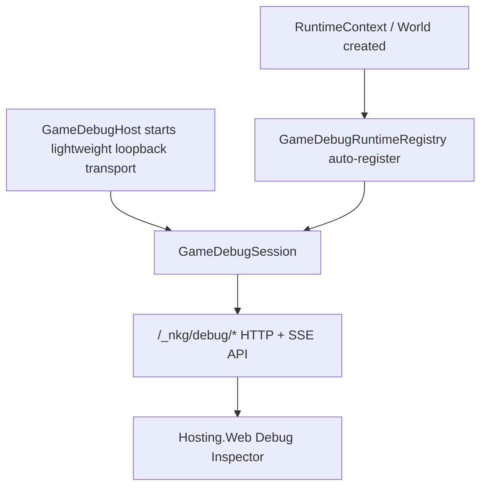
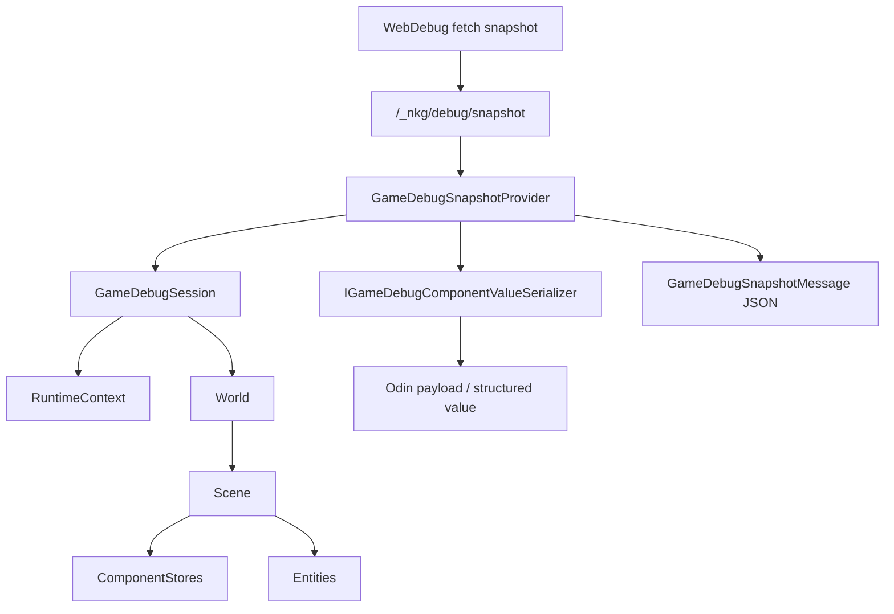
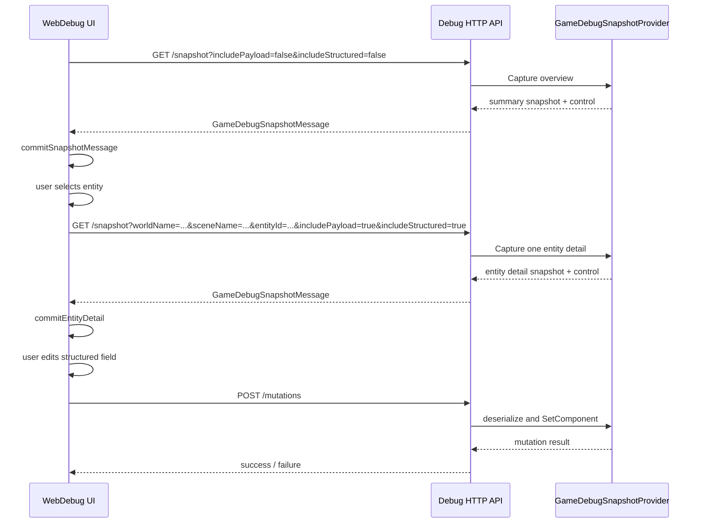
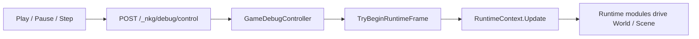
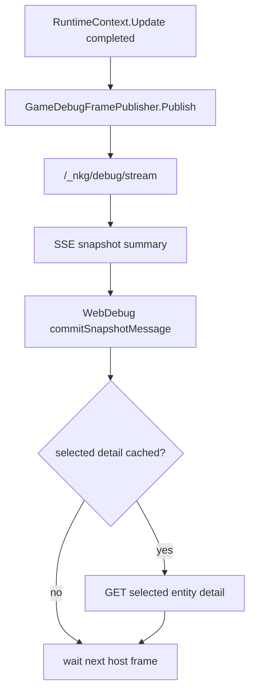
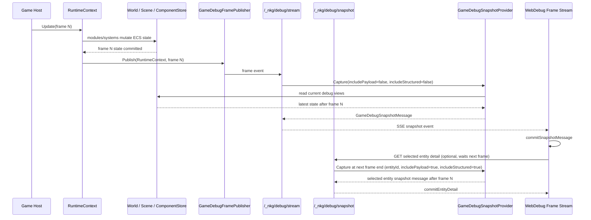
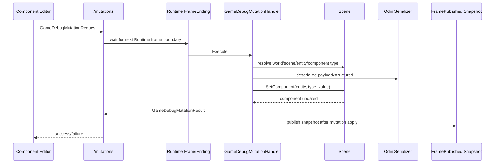
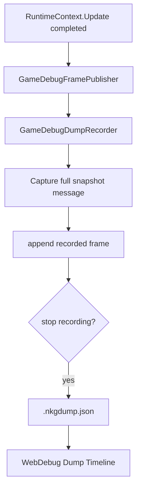
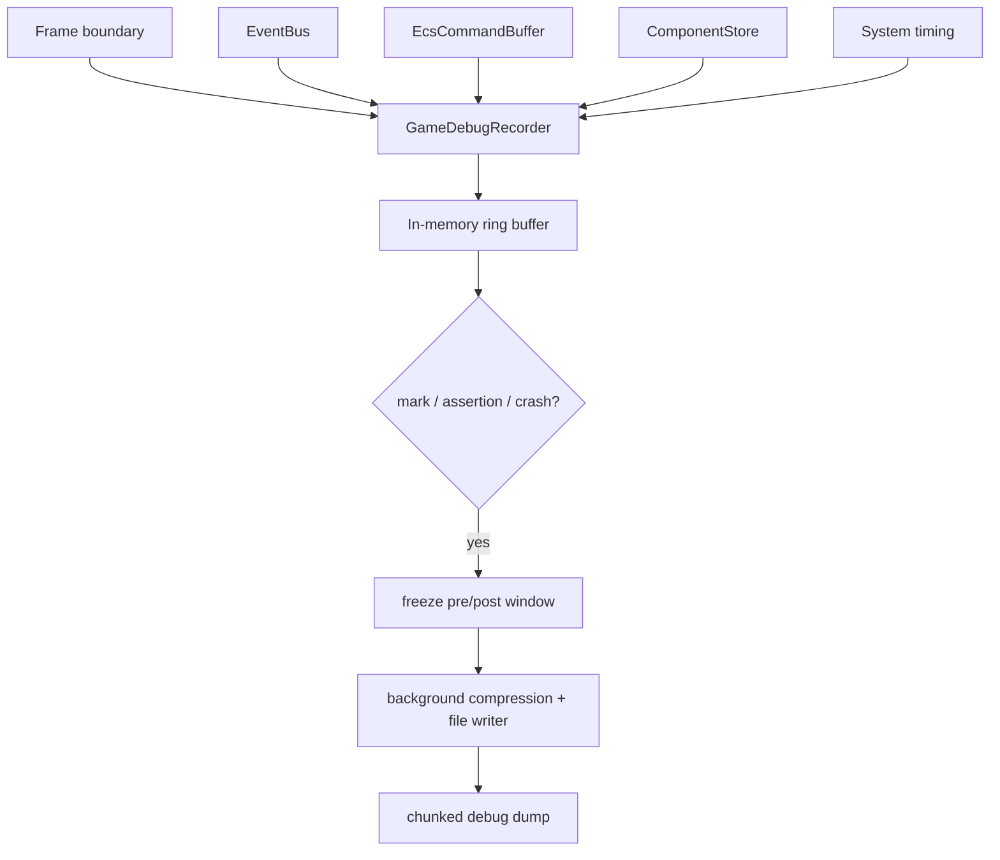
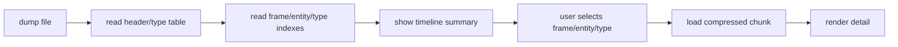

# Debug and Dump Flow

本文记录 NKGGameFramework 当前 WebDebug 调试链路，以及后续一段时间内游戏状态 dump / recorder 的设计方向。目标是把 live inspector、自动刷新、组件编辑、帧级记录和离线 dump 拆清楚，避免回到“每次粗暴 Odin 序列化整个 World”的方案。

## Scope

Debug 能力分三层：

- WebDebug：在线检查器，用于查看当前运行态、暂停/单步、按需查看实体组件值、编辑组件字段。
- Snapshot Window Dump：当前已落地的有界窗口录制，用于保留最近一段 frame snapshot 并在 Web 面板中回放。
- Debug Recorder / Dump：后续离线诊断数据，用于保留一段时间内的世界状态变化、事件、结构变化和必要的组件值。

这些能力共享框架层 introspection 能力，但数据粒度不同。WebDebug 以“当前状态 + 懒加载 detail”为主；Snapshot Window Dump 以“最近 N 帧完整 snapshot window”为主；后续 Recorder 以“帧序列 + ring buffer + 可查询索引”为主。

## Current WebDebug Flow

### Startup



当前框架内置这些调试入口：

- `GameDebugRuntimeRegistry`：自动跟踪当前进程内创建的 `RuntimeContext` 和 `World`。
- `GameDebugSession`：显式注册或默认读取 registry 中的运行态对象。
- `GameDebugHost`：本地轻量 debug host，内置 loopback HTTP/SSE transport。
- `GameDebugHostAutoStart`：通过宿主代码配置开启本地 debug host。

真实宿主更推荐使用普通代码配置项，适合 Unity/Godot、移动端、LeanCLR 和 Server：

```csharp
var debugStartup = GameDebugHostStartupOptions.Localhost(
    port: 5067,
    enableMutations: true);

var debugHost = await GameDebugHostAutoStart.TryStartAsync(debugStartup);
```

`GameDebugHost` 使用 .NET socket async I/O，不主动把连接处理丢进 `Task.Run`；内部 accept loop、连接处理和 HTTP/SSE 读写使用 `UniTask`，公共 `StartAsync` / `TryStartAsync` 仍保留标准 `Task` 形态，方便普通 .NET 宿主调用。`GameDebugHostOptions.MaxConnections` 默认限制为 `32`。Debug 侧的 snapshot、control、mutation 和 dump 操作通过 host 内部 gate 串行执行，避免多个 Web 请求同时触碰同一批调试状态。UniTask 可以降低内部 await 链路成本，但真正跨宿主主线程读写仍需要显式 debug scheduler / Runtime 帧边界兜住。

### HTTP API

当前 WebDebug 使用这些端点：

- `GET /_nkg/debug/health`
- `GET /_nkg/debug/snapshot`
- `GET /_nkg/debug/stream`
- `GET /_nkg/debug/control`
- `POST /_nkg/debug/control`
- `POST /_nkg/debug/mutations`
- `GET /_nkg/debug/dump/recording`
- `POST /_nkg/debug/dump/recording`

`/_nkg/debug/snapshot` 返回 `GameDebugSnapshotMessage`，包含 `frame`、`snapshot` 和 `control`。手动 snapshot 请求不会立即遍历 live state；请求会挂起到下一次 `RuntimeContext.Update` 帧末尾，在 `GameDebugFramePublisher` 回调里捕获数据后再返回。`/_nkg/debug/stream` 通过 SSE 推送同一种 message。两者共享相同的帧末尾 capture 语义，前端也进入同一个 summary commit 逻辑。

`/_nkg/debug/mutations` 启用后也不会在 HTTP 请求线程里直接写 live `Scene`。请求会挂起到下一次 Runtime 帧末 `FrameEnding` 边界，先统一 apply component mutation，再进入 `FramePublished` snapshot 输出。

`/_nkg/debug/snapshot` 和 `/_nkg/debug/stream` 都支持按需裁剪：

| Query | 用途 |
| --- | --- |
| `worldName` | 限定 World |
| `sceneName` | 限定 Scene |
| `entityId` | 限定单个 Entity |
| `entityOffset` / `entityLimit` | Entity 分页 |
| `includePayload` | 是否包含 Odin JSON payload |
| `includeStructured` | 是否包含结构化字段树 |

默认 WebDebug overview 请求必须使用：

```text
includePayload=false&includeStructured=false
```

这样首包只包含 world / scene / entity / component type / graph / skill / buff 摘要，不序列化所有组件值。

### Snapshot Provider



`GameDebugSnapshotProvider` 负责收集：

- runtime modules / procedure modules / procedures
- worlds / scenes
- systems
- component stores
- entities
- components
- skills / buffs

组件值有两种表现：

- `payload`：Odin JSON，适合保存和回写，但体积较大。
- `structured`：结构化字段树，适合 WebDebug UI 直接展示和编辑。

WebDebug 不应在 overview 阶段请求这两种值；只有选择具体实体时才请求 detail。

### WebDebug UI Flow



前端当前行为：

- 初始加载只拉轻量 overview。
- 选择 entity 后才懒加载该 entity 的 payload / structured detail。
- Manual Refresh 和 Frame Stream 都在 Runtime 帧末尾捕获数据，并落到 `commitSnapshotMessage`，统一更新 overview snapshot 和 control。
- detail cache key 为 `worldName + sceneName + entityId`。
- mutation 成功后清空 detail cache，并重新拉 overview。
- component panel 在 detail 未加载完成前显示 loading。

### Control Flow

`/_nkg/debug/control` 用于暂停、继续和单步：



控制命令：

- `play`
- `pause`
- `step`

`RuntimeContext.Update` 在宿主帧开始时通过 `GameDebugController.Shared.TryBeginRuntimeFrame()` 进入调试门控。暂停时不推进 Runtime 帧；step 只消费一次 pending step count。`World.Update` / `Scene.Update` 不作为独立调试出口，它们必须由 Runtime 内的模块或系统推进。

### Refresh Modes

WebDebug 当前只保留两种刷新模式：

- Manual：默认模式。用户点击 `Refresh` 后发起一次 snapshot 请求；Host 等到下一次 `RuntimeContext.Update` 帧末尾捕获并返回。
- Frame Stream：工具栏打开 `Frame` 后，前端通过 `EventSource` 订阅 `/_nkg/debug/stream`。SSE 可以理解成浏览器保持一根长期 HTTP 连接，Host 每次在 `RuntimeContext.Update` 帧末尾往这根连接里写入一条 snapshot message。

Frame Stream 的规则：

- 设置写入 `localStorage`。
- stream 连接建立后不会立即抓取 live state；第一条 summary 来自下一次 Runtime frame event。
- `RuntimeContext.Update` 完成后，通过 `GameDebugFramePublisher` 发布 frame event。
- Hosting 在 frame event callback 中立即捕获轻量 snapshot message，再通过 SSE 推送给 WebDebug。
- 手动 `/_nkg/debug/snapshot` 请求也订阅下一次 frame event，并在同一个 frame event callback 中捕获 snapshot 后返回 HTTP 响应。
- stream summary 强制关闭 `payload` / `structured`，不在推送流里序列化所有组件值。
- 若当前选中 entity 的 detail 已加载，WebDebug 收到 summary 后再按需请求该 entity detail。
- snapshot message 携带 control 状态，Manual 和 Frame Stream 都不需要额外轮询 control。



### Host Frame To WebDebug Update

当前 WebDebug 能看到宿主每帧后的框架数据变化，依赖的是“宿主帧后推送 summary”：



`GameDebugFramePublisher` 的发布点只放在 `RuntimeContext.Update` 末尾。直接调用 `World.Update` 或 `Scene.Update` 不会消费 debug step，也不会发布 frame event；它们只是 Runtime 帧内部的执行细节。

`/_nkg/debug/stream` 是 live UI 通道，不是最终 recorder。它使用 bounded connection buffer；WebDebug 慢时 live 显示可以丢旧 summary。当前 Snapshot Window Dump 会保留有界 recent frame window；后续 delta recorder 才负责更长时间、更低成本的权威逐帧诊断数据。

当前测试覆盖这条链路：

- `GameDebugHostTests.Host_stream_pushes_summary_snapshot_after_framework_frame`
- `GameDebugHostTests.Host_stream_snapshots_match_the_published_frame_event`
- `GameDebugHostTests.Host_snapshot_requests_observe_framework_changes_after_each_runtime_frame`
- `GameDebugFrameGateTests.Runtime_context_update_is_skipped_while_debug_playback_is_paused`
- `GameDebugFrameGateTests.Runtime_context_step_allows_runtime_driven_world_update_once`
- stream 测试启动真实 `GameDebugHost`，连接 `/_nkg/debug/stream`，推进 Runtime 帧后读取第一条 frame event。
- 每次 `runtime.Update(frame)` 后，测试断言 SSE 收到宿主推送的 summary snapshot。
- 连续推进多帧后，测试断言每条 SSE snapshot 与对应 frame event 保持一致。
- snapshot request 测试保留，用于验证 snapshot API 本身会等待 Runtime 帧末尾，再读到对应 frame 的 summary/detail。

## Component Graph Rendering

WebDebug 的组件图使用 React Flow。为避免 frame stream 高频更新时整图重绘，前端现在做了这些稳定化：

- `ComponentNode` / `ComponentGroupNode` 使用 memoized node type。
- node data 不再携带整个 entity；保存时通过 `entityRef` 读取最新 entity。
- `useStableComponents` 按 component graph id 复用未变化的 component snapshot。
- `useStableGraphElements` 按 node / edge id 复用未变化的 React Flow node / edge 对象。
- structured value tree 会尽量复用未变化的子树引用。
- 结构化字段编辑改为 path-based update，`StructuredValueEditor` / `ListField` / `ScalarField` 都可按参数子树 memo。

目标是 frame stream 更新时只有变化的 component / field 更新 UI，而不是每次重建全部节点。

## Mutation Flow

组件编辑仍走通用组件链路，不为 Skill / Buff 写特殊命令：



Mutation apply 的位置选在 Runtime 帧末、snapshot 发布之前：它不会影响本帧已经执行完的 gameplay update，但同一帧推给 WebDebug / dump 的 snapshot 会看到编辑后的组件值。暂停状态下没有 Runtime 帧边界，mutation 请求会等到下一次 Step / Play 推进。

Mutation 默认关闭。生产、外网和多人环境必须保持关闭或接入额外鉴权；本地开发可通过 `GameDebugHostOptions.EnableMutations`、`GameDebugOptions.EnableMutations` 或 `GameDebugHostStartupOptions.EnableMutations` 显式开启。

## Snapshot Window Dump

当前已落地的是有界 snapshot window，而不是最终 delta recorder：



当前行为：

- `POST /_nkg/debug/dump/recording` with `{"command":"start"}` 开始录制，但不立即抓取 live snapshot。
- `POST /_nkg/debug/dump/recording` with `{"command":"stop"}` 停止录制，写出录制期间已捕获的 Runtime 帧 snapshot，并在响应里返回 dump document。
- `GET /_nkg/debug/dump/recording` 返回当前录制状态。
- WebDebug 提供 Record / Stop Rec、Load Dump 和 Dump Timeline。
- WebDebug 开始录制时会把 Web 端进程目录下的 `NKGDump` 作为 `dumpDirectory` 传给 debug host，停止录制后 dump 会写到该目录。
- 直接调用 debug host API 且未提供 `dumpDirectory` 时，会回退到 `GameDebugOptions.DumpDirectory`，默认是临时目录下的 `NKGGameFramework/debug-dumps`，也可在启动 debug host 时覆盖。
- Load Dump 优先使用浏览器 File System Access API 的固定 picker id，让支持的浏览器记住上次打开的 dump 文件夹；不支持时回退到普通 file input。浏览器不允许网页强制指定本地文件选择器的初始目录。
- `GameDebugOptions.DumpIncludeComponentPayloads` 和 `DumpIncludeStructuredComponentValues` 控制 dump 是否包含 Odin payload 和 structured value，默认都开启，便于离线查看实体组件 detail。

这个实现适合短窗口、手动触发、明确 expensive 的诊断场景。录制期间会持续追加帧并在 frame event 中捕获完整 snapshot，因此不应当作为长时间后台 recorder 使用。

## Dump / Recorder Direction

后续长时间游戏状态 dump 不应设计成“后台线程直接 Odin 序列化整个 live World”。原因：

- live World 由主线程更新，后台遍历会遇到集合修改和引用图不稳定。
- 全量 World 对象图包含很多调试不需要的运行时对象。
- 每帧完整序列化会造成 CPU、GC 和 IO 压力。
- 新增模块不应要求手写 delta。

推荐方向是框架层 recorder：



Recorder 分层：

| Mode | 内容 | 成本 | 用途 |
| --- | --- | --- | --- |
| `Trace` | 帧、system timing、事件、命令、结构变化 | 低 | 长期开启 |
| `StateIndex` | store/chunk version、hash、数量、分布 | 低到中 | 定位哪一帧开始异常 |
| `StateDelta` | 框架自动 dirty chunk value block | 中 | 追踪一段时间内状态变化 |
| `Keyframe` | 周期性完整 component store 快照 | 中到高 | 支持任意帧重建 |
| `FullWindow` | debug 专用高保真窗口 | 高 | 疑难 bug 临时开启 |

`mark` 的语义不是“从这一帧才开始抓”，而是“冻结已经在滚动记录的窗口”。例如保留 `[-10s, +3s]`，用户点 mark、断言失败或异常触发时，把这一段窗口落盘。

## Recorder Capture Rules

框架层自动捕获，不要求业务模块手写 delta：

- `RuntimeContext`：frame begin/end、frame index、delta time、pause/step 状态。
- `SystemGroup` / `ISystem`：system timing、执行顺序、异常。
- `EventBus`：publish/fire/fire-now 事件元数据。
- `EcsCommandBuffer`：create/destroy entity、add/remove/set component 等命令。
- `Scene`：entity 生命周期、component 结构变化。
- `ComponentStore`：store version、chunk version、dirty chunk 标记。

组件值捕获规则：

- 默认不捕获所有值，只捕获 store / chunk 摘要。
- watchlist 命中的 component type / entity 可以捕获详细值。
- dirty chunk 模式下，只复制发生写入的 chunk。
- 如果无法精确追踪字段写入，只要发放 mutable ref 或执行 set，就把对应 chunk 标脏。
- 非 ECS 状态通过可选 `IDebugStateProvider` 接入，但不要求每个业务模块实现 delta。

## Dump File Shape

推荐文件格式是 chunked + compressed + indexed：

```text
NKGDUMP
  Header
  TypeTable
  StreamInfo
  FrameIndex
  EntityIndex
  ComponentTypeIndex
  Chunks[]
```

chunk 类型：

- `FrameHeader`
- `SystemSample`
- `EventRecord`
- `CommandRecord`
- `StructuralChange`
- `StoreSummary`
- `DirtyChunkValueBlock`
- `Keyframe`
- `Bookmark`
- `Exception`

写盘线程只处理不可变数据：

1. 主线程在帧边界复制稳定 DTO / binary block。
2. ring buffer 接收这些不可变 block。
3. 后台线程压缩和写盘。
4. 后台线程不直接遍历 live `World`。

## Replay / Query Model

离线查看时不需要一次性读完整 dump：



某一帧状态重建：

1. 找到目标帧之前最近的 keyframe。
2. 加载 keyframe 中的 component store 状态。
3. 应用 keyframe 之后到目标帧之间的 structural changes 和 dirty chunks。
4. 渲染目标 frame 的 entity/component detail。

这和 WebDebug 的懒加载思路一致：先读摘要和索引，点开后再读具体值。

## Current Status

已落地：

- Debug Host / Runtime registry / Debug session。
- Snapshot API，支持 world/scene/entity 过滤、entity 分页、payload/structured 开关。
- Control API，支持 play / pause / step。
- Mutation API，支持通用 component value 编辑。
- WebDebug overview 懒加载，不在首包抓 payload / structured。
- 选中 entity 后再抓 detail。
- `GameDebugFramePublisher` 只覆盖 `RuntimeContext.Update` 帧末尾；`World.Update` 和 `Scene.Update` 由 Runtime 内部驱动，不作为 WebDebug 独立帧出口。
- `/_nkg/debug/stream` 通过 SSE 推送宿主帧后的轻量 summary snapshot，snapshot 在 frame event callback 中捕获。
- WebDebug `Frame` 模式通过 `EventSource` 订阅 host frame stream。
- Component graph 稳定化，避免 Frame Stream 更新时整图重绘。
- `/_nkg/debug/dump/recording` 支持有界 snapshot window 录制。
- WebDebug 支持 Record / Stop Rec、Load Dump 和 Dump Timeline。

待落地：

- 长时间低成本 `GameDebugRecorder` delta ring buffer。
- `Trace` / `StateIndex` / `StateDelta` / `Keyframe` / `FullWindow` 捕获模式。
- dump 文件格式、索引和压缩。
- watchlist / bookmark / assertion-triggered dump。

## Design Rules

- WebDebug 默认不能高频全量 payload。
- Frame Stream 只推 summary；detail 必须按需或按变化刷新。
- Recorder 可以自动记录框架层 delta，但业务模块不应手写 delta。
- 后台线程只能处理稳定 copy，不能直接遍历 live World。
- 全局完整 dump 只作为手动、低频、明确 expensive 的诊断按钮。
- Dump 文件必须支持按 frame / entity / component type 查询。
- Debug 功能默认面向本地开发，不作为生产公网能力暴露。
