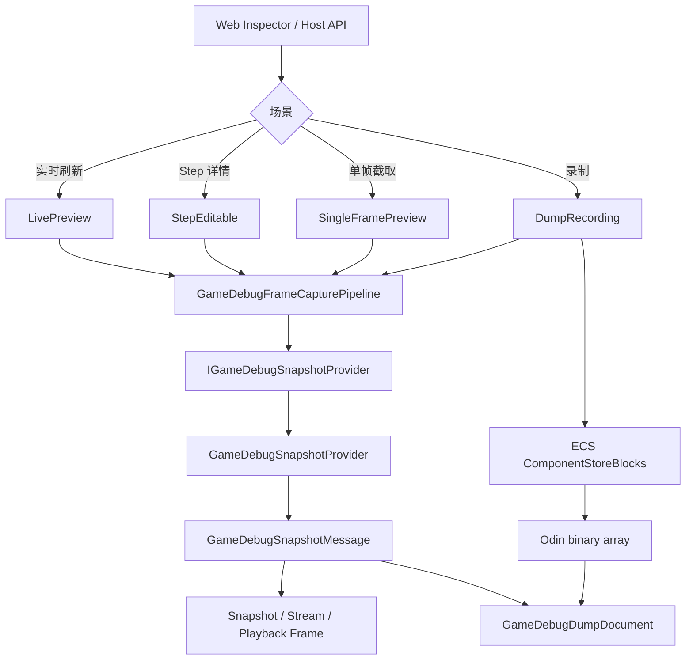
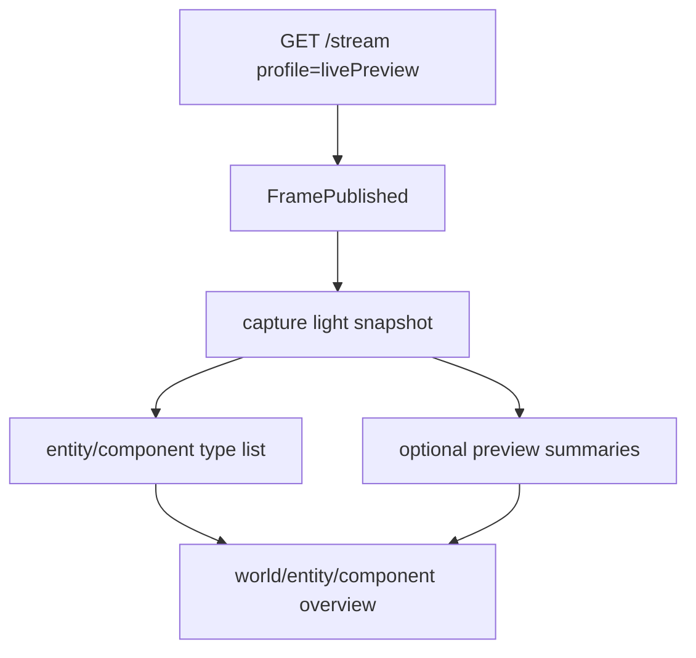
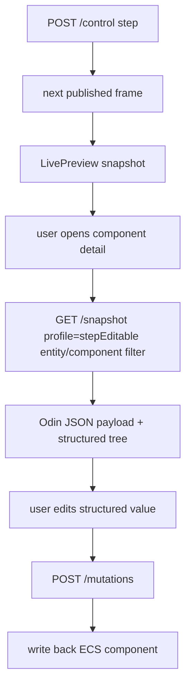
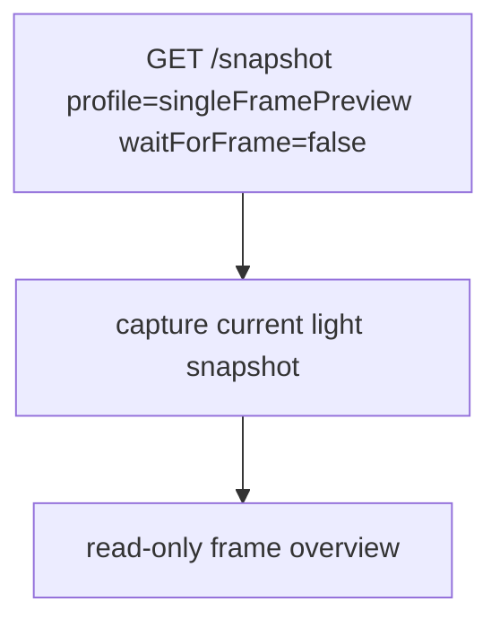
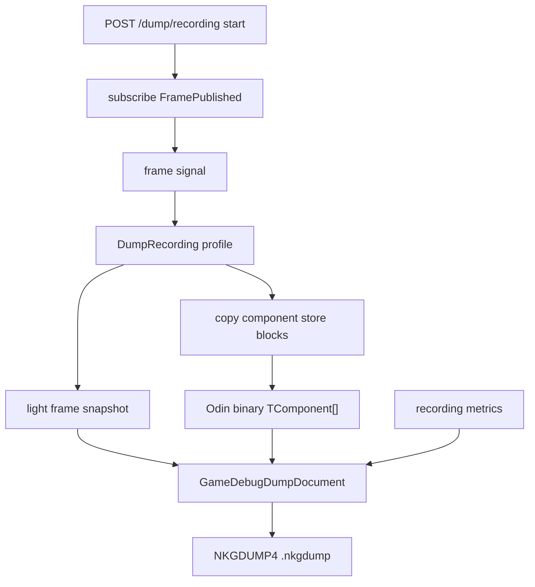
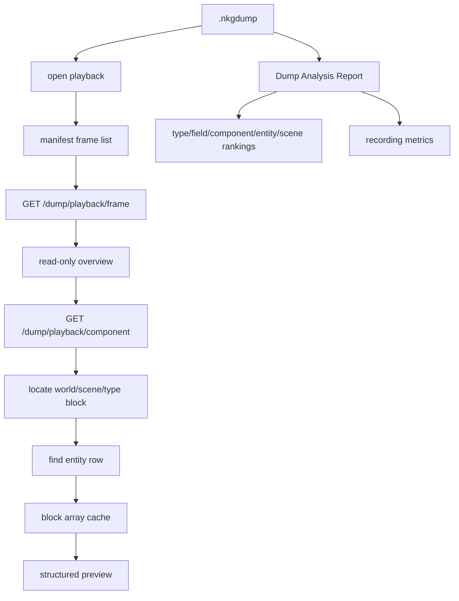

# Debug Capture and Dump Pipeline

本文记录当前 debug 工具的整体架构。核心原则是：四种使用场景共享同一条底层捕获链路，但通过 `GameDebugSnapshotCaptureProfile` 选择不同的数据粒度。只读场景不携带写回游戏世界所需的数据，只有逐帧可编辑调试才启用 Odin payload 和 structured value。

## Four Scenarios

| 场景 | Profile | 是否可写 | 数据粒度 | 典型入口 |
| --- | --- | --- | --- | --- |
| 实时刷新预览 | `LivePreview` | 否 | 轻量 snapshot，用于观察世界变化 | `GET /_nkg/debug/stream` |
| Step 逐帧调试 | `StepEditable` | 是 | 组件详情请求携带 payload/structured，支持 mutation 写回 | `GET /_nkg/debug/snapshot` + `POST /_nkg/debug/mutations` |
| 单帧截取预览 | `SingleFramePreview` | 否 | 轻量 snapshot，用于截取当前帧概览 | `GET /_nkg/debug/snapshot` |
| 定时录制 | `DumpRecording` | 否 | 轻量 frame snapshot + ECS store block | `POST /_nkg/debug/dump/recording` |

`DumpPlaybackPreview` 用于表达 dump 回放时的只读预览语义。回放 frame 返回轻量 snapshot，组件详情通过 `GET /_nkg/debug/dump/playback/component` 从 dump block 按需 materialize。

## Unified Call Chain

四种场景不会拆成四套底层实现。入口只负责选择 profile，随后统一进入 `GameDebugFrameCapturePipeline`。

## Profile Responsibilities

`GameDebugSnapshotCaptureOptions` 中的 profile 会设置默认开关，旧的 `includePayload`、`includeStructured` 等 query 参数仍可覆盖默认值，避免破坏外部调用。

| Profile | payload | structured | runtime details | systems | store summaries | entity summaries | component graph |
| --- | --- | --- | --- | --- | --- | --- | --- |
| `LivePreview` | 否 | 否 | 是 | 是 | 是 | 是 | 是 |
| `SingleFramePreview` | 否 | 否 | 是 | 是 | 是 | 是 | 是 |
| `StepEditable` | 是 | 是 | 是 | 是 | 是 | 是 | 是 |
| `DumpRecording` | 否 | 否 | 否 | 否 | 否 | 否 | 否 |
| `DumpPlaybackPreview` | 否 | 否 | 否 | 否 | 否 | 否 | 否 |

这样可以保证：

- 只读预览不做通用组件值序列化。
- Step 详情保留 Odin generic payload，用户不用写组件 serializer。
- Dump 录制只保留回放定位所需的 world、scene、entity、component type 骨架。
- Dump 中真实组件值来自 ECS `ComponentStoreBlock`，而不是逐组件 snapshot payload。

## Live Preview Flow

实时刷新只用于观察世界变化，不允许 mutation。Web 端不会请求 component payload 或 structured value。

## Step Editable Flow

Step 模式下，帧级 snapshot 仍然可以轻量。只有用户打开具体组件详情时，才使用 `StepEditable` 捕获可写数据。写回路径仍走统一的 Odin generic serializer。

## Single Frame Preview Flow

单帧截取不写回游戏世界，因此不需要 payload、structured 和 mutation 数据。

## Dump Recording Flow

Dump 录制不做抽帧，不做窗口裁剪，发布多少帧就记录多少帧。录制文件中包含 `GameDebugDumpRecordingMetrics`，用于后续分析运行时压力。

## Dump Playback and Analysis

回放不会恢复 live world，也不会写回游戏。组件详情只在用户查看时按需反序列化 block，并缓存最近使用的 block array。

## Dump Analysis Report

分析报告读取真实 `.nkgdump` 文件：

- `serializedBytes` 表示文件实际大小。
- `payloadBytes` 表示 block payload 保存成本。
- `structuredBytes` 表示分析或预览时展开出来的结构化视图成本。
- `recordingMetrics` 展示录制时的 captured/published、callback 耗时、capture 耗时、store 数、entity row 数等。

报告可以通过 API 获取，也可以在 Web 的 `Dump Report` dockview 中查看。

## Entry Points

- `GET /_nkg/debug/snapshot?profile=singleFramePreview`
- `GET /_nkg/debug/snapshot?profile=stepEditable`
- `GET /_nkg/debug/stream?profile=livePreview`
- `POST /_nkg/debug/mutations`
- `GET /_nkg/debug/dump/recording`
- `POST /_nkg/debug/dump/recording`
- `POST /_nkg/debug/dump/playback`
- `POST /_nkg/debug/dump/playback/upload`
- `GET /_nkg/debug/dump/playback/frame`
- `GET /_nkg/debug/dump/playback/component`
- `POST /_nkg/debug/dump/analysis`
- `POST /_nkg/debug/dump/analysis/upload`

## Maintenance Rules

- 新场景应先定义 profile，再接入统一 pipeline。
- 不要为业务组件写特化 recorder。
- 只有 `StepEditable` 需要 mutation/writeback 所需的数据。
- 只读场景默认不请求 payload 和 structured。
- Dump 录制必须保留全量帧，不做抽帧或窗口裁剪。
- Dump 文件格式不兼容旧版本时，直接升级 binary document version。
