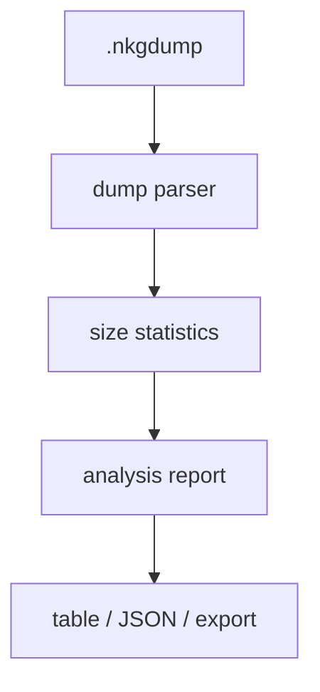
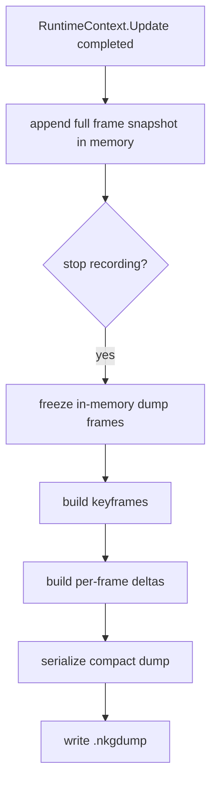
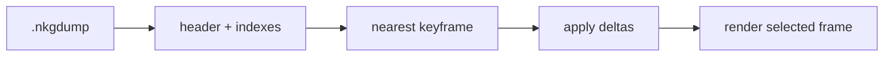

# Debug and Dump Flow

本文记录 dump 的最终实现方案。WebDebug 的 live inspector、自动刷新、组件编辑和 frame stream 仍按现有思路继续；这里重点只写两件事：

1. dump 文件分析报告工具
2. 点击停止录制时，对内存里的 dump 帧做关键帧和每帧差量处理，再写成真正的 `.nkgdump`

## Scope

Debug 能力分三层：

- WebDebug：在线检查器，用于查看当前运行态、暂停/单步、按需查看实体组件值、编辑组件字段。
- Dump Analysis Report：离线分析工具，用于统计 dump 里哪些类、哪些字段、哪些组件值最占空间。
- Debug Recorder / Dump：录制期先把完整帧留在内存，停止时再做 keyframe + delta 压缩并落盘。

这三层共享框架层 introspection 能力，但数据粒度不同。WebDebug 以“当前状态 + 懒加载 detail”为主；Report 以“静态归因和占比”为主；Recorder 以“内存里的完整帧 + 停止时压缩”为主。

## Terms

- `payload`：`ComponentValueDebugSnapshot` 里的主序列化结果，面向保存、回放和写回。
- `structured`：同一份 `ComponentValueDebugSnapshot` 里的树形视图，面向 WebDebug 展示、编辑和兜底重建。
- `keyframe`：周期性的完整快照，作为后续差量重建的锚点。
- `delta`：某一帧相对 keyframe 或前一帧的变化量。

## Dump Analysis Report

分析报告工具只做一件事：读 dump，算占比，告诉我们哪里最胖。

报告至少要给出这些信息：

- 总帧数、关键帧数、差量帧数、压缩后文件大小。
- `payload` 和 `structured` 各自占了多少。
- 按类统计的空间排行，能直接看到最重的类型。
- 按字段统计的空间排行，能直接看到最重的字段路径。
- 按 component / entity / scene 聚合出来的热点。

这个工具是诊断用的，不参与录制写盘，也不反向修改 dump 格式。它的价值是把“哪里浪费了”说清楚，然后让我们再去决定要不要加序列化属性或收敛数据结构。

特别是 `SkillDefinition`、`BehaviorTreeDefinition` 这类对象，录制器不做任何特化处理，它们就是普通对象；如果它们真的很大，就应该在 report 里被看见，而不是在 recorder 里偷偷绕开。

## Stop-Recording Compaction

录制阶段保持简单：每帧完整 snapshot 先留在内存里，不在 gameplay 运行时做差量整合，也不引入临时文件。
停止录制时，再把这批内存数据一次性处理成更紧凑的写盘结果。

处理顺序建议是：

1. 停止录制，先把内存里的帧列表冻结成不可变输入。
2. 按固定间隔切关键帧，初版可以先用 60 帧一组，后续再调。
3. 以最近的关键帧为基准，计算后续每一帧的差量。
4. 把关键帧和差量一起写进真正的 `.nkgdump`。
5. 写盘和压缩可以放到后台线程做，但输入必须是已经冻结好的内存快照。

这里不做这些事：

- 不做 temp file spool。
- 不做奇怪的 frame reference table。
- 不在录制时引入业务特化的存储结构。
- 不要求 `SkillDefinition`、`BehaviorTreeDefinition` 走特殊路径。
- 不把 delta 整合塞回 gameplay 运行帧里。

这样做的核心好处是，运行时链路还是原来的全量对象捕获，保持通用；真正的体积优化只发生在 stop 这一刻，既能利用多线程，也不会把复杂度散进业务代码。

## Replay Model

回放时不需要一次读完整个文件，也不需要重新跑录制逻辑。
读 dump 的基本顺序是：

1. 先读头部和索引。
2. 找到目标帧前最近的关键帧。
3. 读取该关键帧的完整状态。
4. 依次应用后续帧的差量，重建目标帧。

这和 WebDebug 的懒加载思路一致：先读摘要，再在需要时读具体值。区别只是这里的“具体值”来自离线文件，而不是 live world。

## Entry Points

当前录制和回放入口保持现有形态：

- `POST /_nkg/debug/dump/recording`：`start` / `stop`
- `GET /_nkg/debug/dump/recording`
- `POST /_nkg/debug/dump/playback`
- `POST /_nkg/debug/dump/playback/upload`
- `GET /_nkg/debug/dump/playback/frame`

## Current Boundary

当前实现和最终方案之间的边界很简单：

- live WebDebug 继续按现有方式工作。
- dump 录制继续先把完整帧留在内存。
- stop 时再做 keyframe + delta 压缩。
- analysis report 只负责读文件和归因，不碰写盘链路。

这套约束能保证 recorder 还是通用的，优化也还是数据驱动的。

## Non-Goals

- 不做 temp file。
- 不做 frame reference table。
- 不在 gameplay 运行时做增量整合。
- 不为 `SkillDefinition`、`BehaviorTreeDefinition` 写特化录制逻辑。
- 不让 report 工具参与写盘。
