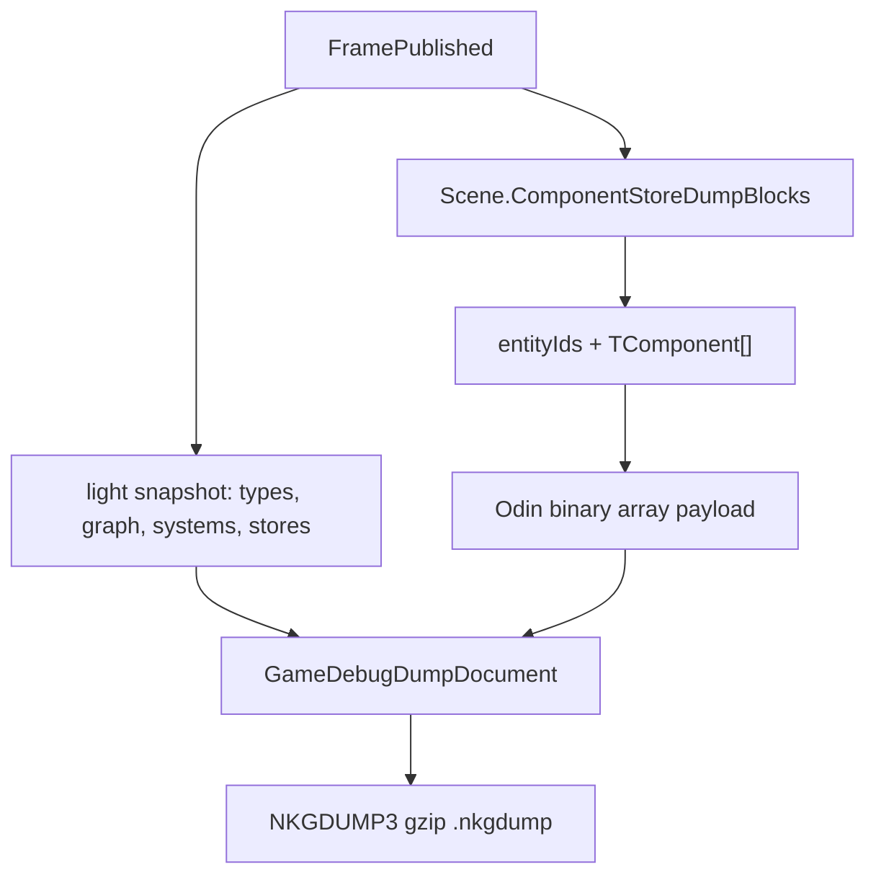
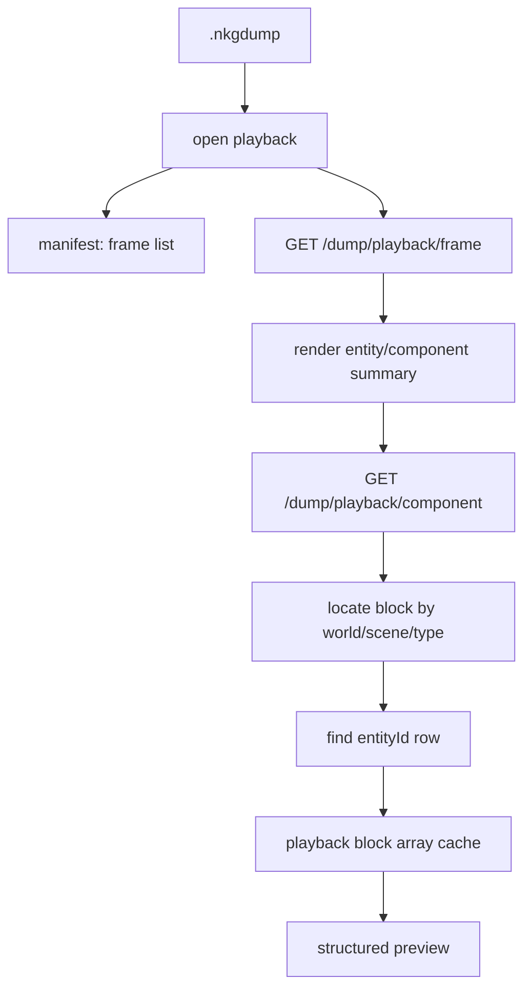

# Debug Dump Implementation Plan

本文是 [`debug-and-dump.md`](./debug-and-dump.md) 的落地路线图。当前路线已经从“逐组件 snapshot payload + keyframe/delta”调整为“轻量 frame snapshot + `ComponentStoreBlock` 批量 Odin payload”。旧 dump 格式不再兼容。

## Goals

- 报告工具能定位最占空间的类型、字段、组件、实体和场景。
- 实时 snapshot 的 summary 路径不序列化普通组件值，组件详情按需读取。
- dump 录制不再保存逐组件 payload / structured，而是按 ECS `ComponentStore` 批量写 Odin binary block。
- 回放接口保持 Web UI 可用：frame 先返回轻量摘要，组件详情再按 entity row materialize。
- 用户新增自定义 `IComponent` 后，不需要为 debug 写专门 recorder 或 DTO。
- 不引入 temp file、frame reference table 或业务特化 recorder。

## Current Architecture

| Area | Current shape | Verification |
| --- | --- | --- |
| Live snapshot summary | `includePayload=false && includeStructured=false` 时只读取组件类型元数据 | summary 使用会抛异常的 serializer 仍可捕获组件列表 |
| Live component detail | 过滤到单个 entity/component 后用 Odin 生成 payload / structured | component detail、mutation 测试覆盖 |
| Dump recording | 每帧捕获轻量 `GameDebugSnapshotMessage` + `BlockFrames` | host dump 测试验证 `.nkgdump` 有 block payload |
| Store block payload | 每个 scene/component type 写 `entityIds + TComponent[]` Odin binary | ECS block roundtrip 测试覆盖 |
| Dump file | `NKGDUMP3\n` container magic + gzip JSON document version | dump file reconstruction 测试覆盖 |
| Dump playback | frame 返回轻量 snapshot，组件详情从 block row materialize structured | playback component 测试验证第 2 帧字段值 |
| Dump analysis | 优先分析 block payload，并按需 materialize structured 做字段排行 | recorded block dump analysis 测试覆盖 |
| Web UI | 集成录制、加载、回放、分析 dockview | TypeScript/Vite build 覆盖 |

## Data Model

`GameDebugDumpDocument.Frames` 保留 UI 回放需要的轻量 frame 信息。`GameDebugDumpDocument.BlockFrames` 保存真实组件值，每个 block 对应一个 scene 下的一种组件类型。默认录制不截断；配置 `GameDebugOptions.MaxRecordedDumpFrames` 后只保留最近 N 帧，并在 manifest 中报告 `DroppedFrameCount`。

## Replay Model

回放不需要恢复 live world，也不需要业务组件特化逻辑。只要组件是 ECS store 里的 `IComponent`，就能通过 `TComponent[]` block 被记录和查看。组件详情接口缓存最近 materialize 过的 block array，重复查看同一帧同一组件 store 时不再重复解码整个数组。

## Report Tool

报告工具读取 `.nkgdump` 后优先走 block 分析：

1. 按 block payload 统计真实保存成本。
2. 按 entity row 分摊 payload 大小。
3. 按需 materialize structured，用于字段级排行。
4. 聚合 type、field、component、entity、scene。
5. 输出 JSON 和 table，并在 Web `Dump Report` dockview 展示。

`payloadBytes` 表示 dump 里真实保存的 block bytes 分摊；`structuredBytes` 表示为了报告/预览临时展开后的结构化视图大小。

## Acceptance Criteria

- 报告工具能明确指出最重的类型和字段。
- 报告工具能分别展示 actual file size、`payload` 和 `structured` 占比。
- 停止录制后的 `.nkgdump` 不保存逐组件 structured。
- 回放 frame 轻量，组件详情能从 block 还原出正确字段值。
- 实时 summary 不对普通组件做值序列化。
- 新增自定义组件不需要专门 debug 代码即可被 snapshot、dump、analysis 处理。
- 录制器没有业务特化分支。
- 没有引入 temp file 或 frame reference table。
- 配置 `MaxRecordedDumpFrames` 时只保留最近窗口并正确报告丢弃帧数。

## Remaining Tuning Ideas

- 对很大的 component store block 做分块，降低单个组件详情的反序列化成本。
- 对 report 增加采样模式，避免超大 dump 分析时展开所有 row。
- 增加性能基准，分别测 summary snapshot、recording capture、analysis materialization。
