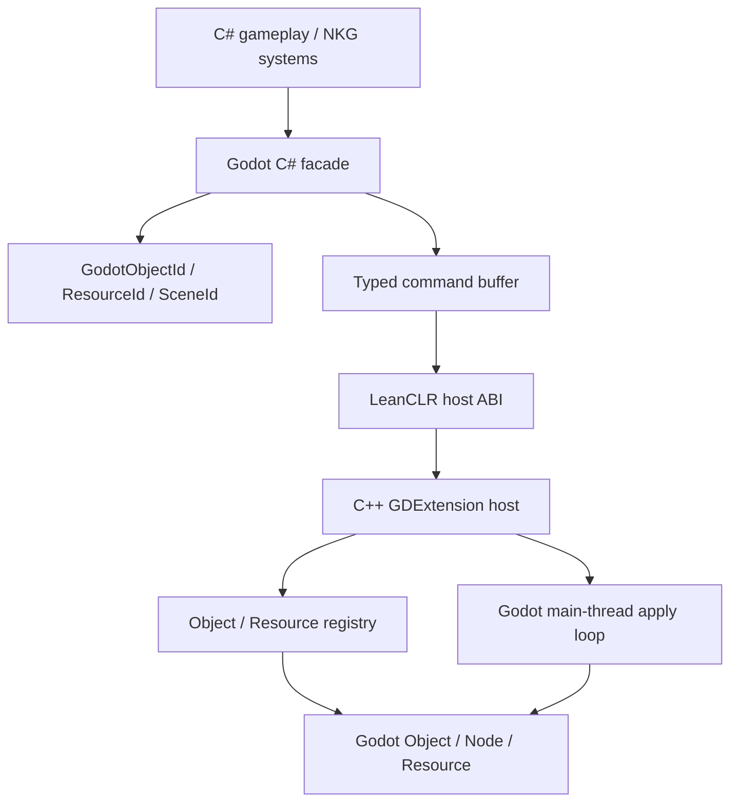

# Godot + LeanCLR Generic Host Binding Plan

本文记录后续要做的通用 Godot 胶水层计划。当前 `GodotPlaneSample` 已经证明 C++ GDExtension 可以嵌入 LeanCLR，并由 C++ host 直接创建和更新 Godot 对象；但 `NkgLeanClrPlaneHost` 仍然是打飞机样例专用实现，不应作为长期通用架构继续扩展。

## Goal

目标是把当前项目专用 host 演进为一套可复用的 Godot Host Binding：

```text
C# / LeanCLR gameplay code
  -> generated or hand-written Godot host facade
  -> typed command buffer / host service ABI
  -> C++ GDExtension host
  -> Godot Object / Node / Resource / SceneTree
```

这套层要让以后更复杂的项目可以直接从 C# 侧创建、配置、调用和销毁 Godot 对象，而不是每个项目都写一套 `PlaneHost`、`BulletHost` 之类的专用桥。

## Non-Goals

- 不复刻完整 GodotSharp runtime。
- 不依赖 Godot 官方 C# 扩展或 CoreCLR host。
- 不把 `NKGGameFramework.Hosting`、HTTP/SSE/WebSocket debug transport 带进 LeanCLR runtime。
- 不在第一阶段追求全量 Godot API 覆盖。
- 不继续把 GDScript 字符串协议作为主交互模型。

## Current State

当前样例已经有：

- `NkgLeanClrRuntimeBridge`：通用 LeanCLR 调用器，负责加载 managed assembly、查找并调用 managed 方法。
- `NkgLeanClrManagedBridge`：通用 LeanCLR managed bridge lifecycle，负责 configure/initialize/ready 和 invoke 封装。
- `NkgLeanClrPlaneBridge`：样例专用 facade，负责把 `PlaneGameBridge` 的输入、session 和 debug 方法表暴露给 Godot。
- `GodotDebugEndpointBridge` / `NkgGodotDebugTransport`：Godot debug endpoint 默认策略和 native HTTP/SSE pump 已沉淀到 Adapter.Godot。
- `GodotHostCommandBuffer` / `NkgGodotHostCommandReader`：managed 侧输出 direct `byte[]` binary command buffer，native 侧解码成 typed frame/node command；`NKGCB1` string envelope 仅保留为调试兼容路径。
- `NkgGodotObjectRegistry` / `NkgGodotResourceRegistry`：提供 Godot object/resource registry 基础；当前 `Node2D` 同步通过 object registry 的 convenience path 承接。
- `NkgGodotHost`：组合 native debug transport、command reader 和 `Node2D` registry，承接通用 host 命令应用主流程。
- `NkgGodotInputPump` / `NkgGodotStatusFields`：Godot action input pump 和 managed status key/value parser 已沉淀到 Adapter.Godot。
- `NkgLeanClrPlaneHost`：Godot 场景 root，保留样例动作绑定、HUD 文本组织和 smoke-only 状态访问器。
- `PlaneGameBridge`：C# 侧的输入和 ECS session 入口。
- 项目内 staged BCL：`samples/GodotPlaneSample/leanclr_bcl/net10.0`。

当前缺口：

- Host API 仍有样例专用部分：动作绑定、HUD 文本组织和 plane-specific smoke counters。
- C# 到 C++ 已从内部 snapshot string 推进为 direct `byte[]` binary command buffer。
- 已有 Object/Resource registry 基础、第一批通用 Godot object command opcode、ClassDB-backed native object creation、managed facade 和最小 Variant payload；还没有完整 Variant marshalling 和生成式 API 覆盖。
- Variant marshalling 目前覆盖 `Color`、`PackedVector2Array` 和 `string` 的最小属性设置路径。
- 没有生成器。
- 没有信号、方法调用、属性读写、资源加载、场景实例化等通用能力。

## Target Architecture



## Core Concepts

### ObjectId

C# 不持有 Godot 指针，只持有稳定的句柄：

```csharp
public readonly record struct GodotObjectId(int Value);
public readonly record struct GodotResourceId(int Value);
```

C++ host 维护真实对象表：

```text
ObjectId -> Object*
ResourceId -> Ref<Resource>
```

### Command Buffer

C# 一帧内提交批量命令，C++ 在 Godot 主线程统一应用：

```text
CreateNode
DestroyObject
SetParent
SetProperty
CallMethod
SetTransform2D
LoadResource
InstantiateScene
ConnectSignal
DisconnectSignal
```

这样避免每个字段、每个对象都跨边界调用一次，也为移动端和 Web 留出优化空间。

### Variant Marshalling

第一阶段支持最小值类型：

```text
bool
int
long
float
double
string
Vector2
Vector3
Color
ObjectId
ResourceId
```

第二阶段再扩展：

```text
Array
Dictionary
Packed arrays
Callable
Signal
Transform2D
Transform3D
Quaternion
Basis
```

### Main Thread Boundary

Godot Object / Node / Resource 操作必须在 Godot 主线程应用。C# 可以生成命令，但命令播放由 C++ host 在 `_process` 或显式 flush 点执行。

## Candidate C# API Shape

第一阶段先手写核心 facade：

```csharp
public static class GodotHost
{
    public static GodotNode CreateNode(string typeName, string? name = null);
    public static void Destroy(GodotObjectId id);
    public static void SetParent(GodotObjectId child, GodotObjectId parent);
    public static GodotResource LoadResource(string path);
    public static void Flush();
}

public readonly struct GodotNode
{
    public GodotObjectId Id { get; }

    public void SetPosition(Vector2 value);
    public void SetRotation(float value);
    public void SetScale(Vector2 value);
    public void SetVisible(bool value);
    public void SetProperty(string name, GodotVariant value);
    public GodotVariant Call(string method, ReadOnlySpan<GodotVariant> args);
}
```

后续生成类型化 wrapper：

```csharp
public readonly struct GodotSprite2D
{
    public GodotObjectId Id { get; }

    public Vector2 Position { set; }
    public GodotResource Texture { set; }
    public bool Visible { set; }
}
```

## Candidate Native Host Shape

C++ host 负责：

- `ObjectRegistry`：管理 `ObjectId -> Object*`。
- `ResourceRegistry`：管理 `ResourceId -> Ref<Resource>`。
- `CommandDecoder`：读取 C# 命令缓冲。
- `CommandApplier`：在 Godot 主线程创建对象、设置属性、调用方法。
- `VariantCodec`：在 LeanCLR value payload 和 Godot `Variant` 之间转换。
- `SignalBridge`：把 Godot signal 转成 C# 可轮询事件或回调命令。
- `LifetimeGuard`：处理 `queue_free`、`RefCounted`、场景卸载和 dangling handle。

## Generation Strategy

不要直接复制 GodotSharp runtime。推荐复用 Godot 的 API 数据源和生成思想：

```text
Godot --dump-extension-api
  -> extension_api.json
  -> generate C++ dispatch tables
  -> generate C# facade types
  -> generate Variant marshalling metadata
```

生成器优先覆盖常用 gameplay API：

```text
Object
Node
Node2D
Node3D
CanvasItem
Sprite2D
AnimatedSprite2D
Label
Control
Area2D
CollisionShape2D
Camera2D
AudioStreamPlayer
PackedScene
ResourceLoader
SceneTree
```

## Phase Plan

### Phase 1: Generic Core Host

- 已完成部分：`NkgLeanClrRuntimeBridge`、`NkgLeanClrManagedBridge`、`NkgGodotDebugTransport`、`NkgGodotObjectRegistry`、`NkgGodotResourceRegistry`、`GodotHostCommandBuffer`、`NkgGodotHost` 已进入 Adapter.Godot。
- 已完成部分：Godot input action pump 和 status key/value parser 已进入 Adapter.Godot。
- 已完成部分：`NkgLeanClrPlaneHost` 已改为通过 `NkgGodotHost` 应用 command buffer，样例侧只保留输入、HUD 和视觉策略。
- 已完成部分：command buffer / native reader / `NkgGodotHost` 支持 `CreateNode`、`DestroyObject`、`SetParent`、`SetTransform2D`、`SetVisible`、`SetProperty` 的最小通路。
- 已完成部分：C# 侧提供最小 `GodotHostCommands` / `GodotNode` 手写 facade。
- 已完成部分：打飞机样例 visual 输出已改用通用 `CreateNode` / `SetProperty` / `SetTransform2D` 命令，native host 不再负责 plane-specific Polygon2D 创建。
- 待完成：扩大属性/方法/Variant 支持，并继续收敛剩余 plane-specific HUD 文本和 smoke 状态访问器。

验收：

- C# 创建玩家、敌人、子弹节点。
- C# 更新 transform。
- C# 销毁子弹或敌人。
- Headless smoke 能证明对象创建、移动、销毁。

### Phase 2: Typed Command Buffer

- 已完成部分：替换当前内部 snapshot string 为 direct `byte[]` binary command buffer。
- 已完成部分：native reader 将 byte buffer 解码为 typed frame/node command，并保留 `NKGCB1` / 旧文本格式 fallback。
- 待完成：扩大 command set，支持更多 Godot object/resource 操作。
- 支持批量提交和主线程 flush。
- 提供错误诊断：未知对象、类型错误、方法不存在、资源加载失败。

验收：

- 每帧对象同步不再经过字符串解析。
- smoke 输出命令数、对象数、错误数。
- command buffer 能承载至少 1000 个对象更新。

### Phase 3: Resource And Scene Services

- 支持 `LoadResource(path)`。
- 支持 `InstantiateScene(path)`。
- 支持 `Texture2D`、`PackedScene`、`Material`、`AudioStream`。
- 支持资源引用计数和释放策略。

验收：

- C# 能加载贴图并赋给 `Sprite2D`。
- C# 能实例化 Godot 场景并挂到指定 parent。
- 资源重复加载有缓存。

### Phase 4: Signal And Event Bridge

- C++ host 连接 Godot signal。
- C# 侧轮询事件队列或注册轻量 callback id。
- 支持输入事件、Area enter/exit、Animation finished、Button pressed 等常用 signal。

验收：

- C# 能收到 Godot 对象 signal。
- signal payload 能通过 Variant codec 传递。
- 断开连接后不会泄漏对象引用。

### Phase 5: Generated Bindings

- 基于 `extension_api.json` 生成 C# wrapper 和 C++ dispatch metadata。
- 先生成白名单类，不做全量 Godot API。
- 生成属性、方法、枚举、常量、基础文档注释。

验收：

- 生成 `GodotNode2D`、`GodotSprite2D`、`GodotLabel` 等 wrapper。
- wrapper 能通过 command buffer 调用 native host。
- 手写 facade 与生成 facade 能共存。

### Phase 6: Export Profiles

- 把 staged BCL 和 native bridge 纳入 Godot export 目录。
- 按 Windows、Android、iOS、Web 分平台处理 native library、BCL profile 和资源路径。
- 为移动端裁剪 BCL 和 API 白名单。

验收：

- 桌面包不依赖本机 `.NET shared framework`。
- Android/iOS/Web 至少有明确的打包结构和缺口清单。

## Open Questions

- LeanCLR 到 native 的最佳 ABI 是 internal call、P/Invoke facade，还是继续由 native invoke managed 并读取 managed buffer？
- Variant payload 是 binary buffer、shared memory、还是固定 struct array？
- 对象句柄是否需要 generation/version，避免 stale handle 误用？
- 信号回调采用 pull event queue 还是 callback id？
- 生成器放在 NKG repo 里，还是独立为 `NKGGameFramework.GodotBindingGenerator`？
- API 白名单由代码配置、JSON 配置，还是按项目扫描生成？

## Recommended Next Step

下一次继续做这条线时，优先收敛剩余 sample host 胶水：

```text
把 NkgLeanClrPlaneHost 剩余的 HUD/status 边界继续拆小，
并评估哪些可以进入通用 host services。
```

这一步完成后，当前样例才会从“通过通用中间层承载的项目专用 host”进一步进入“可复用 Godot host binding”的轨道。
