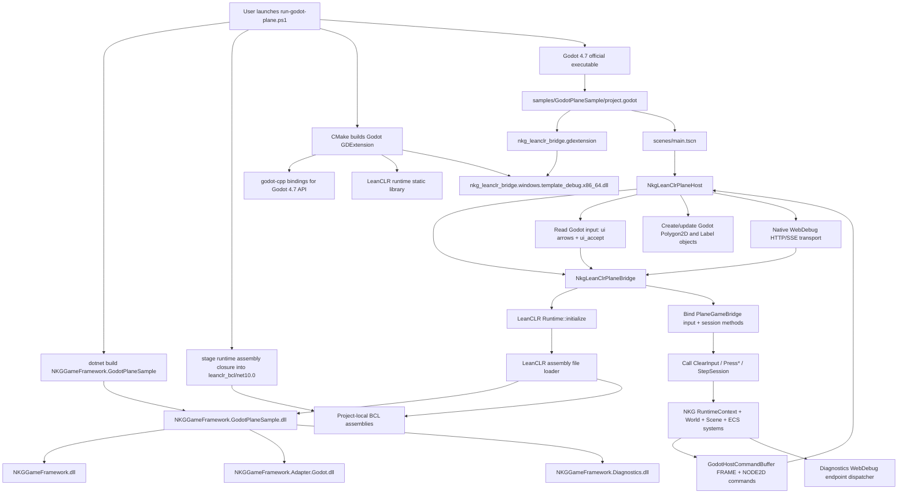
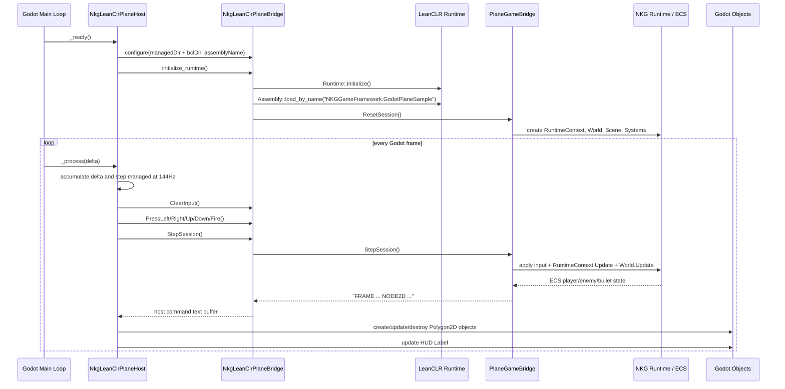
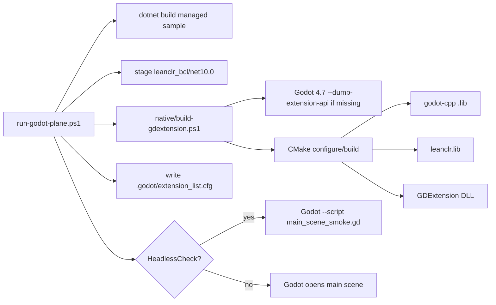

# Godot + LeanCLR Runtime Structure

本文记录当前 `NKGGameFramework` 接入 Godot 4.7 的运行结构。当前样例不依赖 Godot 官方 C# / GodotSharp，而是通过 GDExtension 在 Godot 进程内嵌入 LeanCLR，再由 LeanCLR 驱动 NKG managed 逻辑。桌面 WebDebug transport 由 Godot native 层承载，managed 侧只处理 NKG debug 命令和 payload，不打开 socket。

## Current Project Layout

```text
NKGGameFramework/
  src/
    NKGGameFramework/                    # 引擎无关核心：RuntimeContext、ECS、Gameplay、Nodes、Serialization、轻量 debug DTO/control/frame
    NKGGameFramework.Adapter.Godot/      # Godot managed contracts，不引用 GodotSharp
      native/src/                       # Godot native adapter：LeanCLR runtime bridge、debug transport、node registry
    NKGGameFramework.Hosting/            # HTTP/SSE debug host，本样例不引用
    NKGGameFramework.Diagnostics/        # snapshot provider、mutation、dump、analysis、transport-independent WebDebug endpoint dispatcher

  samples/
    NKGGameFramework.GodotPlaneSample/   # C# managed 打飞机逻辑
      PlaneGameBridge.cs                 # LeanCLR 调用入口、输入入口、ECS snapshot 入口
      PlaneGame.cs                       # managed session 和 snapshot 输出
      PlaneGameComponents.cs             # ECS component 和 scene component
      PlaneGameRules.cs                  # 玩法常量和敌人生成规则
      PlaneGameSystems.cs                # 输入、敌人、子弹、移动、碰撞系统

    GodotPlaneSample/                    # Godot 4.7 工程
      project.godot
      scenes/main.tscn                   # root 是 NkgLeanClrPlaneHost
      leanclr_bcl/net10.0                # staged BCL 程序集，随 Godot 工程打包
      addons/nkg_leanclr_bridge/
        nkg_leanclr_bridge.gdextension   # GDExtension 声明
      native/
        CMakeLists.txt                   # 构建 native bridge
        build-gdextension.ps1
        src/
          nkg_leanclr_plane_bridge.*     # 样例专用 LeanCLR bridge facade
          nkg_leanclr_plane_host.*       # Godot 对象胶水层，创建/更新 Polygon2D/Label
          register_types.*               # 注册 NkgLeanClrPlaneBridge / NkgLeanClrPlaneHost
      tools/
        run-godot-plane.ps1              # 一键 build + stage BCL + run / headless check
        ensure-godot-4.7.ps1             # 下载官方 Godot 4.7 stable 并拉取官方 godot-cpp
        stage-leanclr-bcl.ps1            # 从 managed 输出引用闭包 stage 所需 .NET 10 runtime assemblies
        main_scene_smoke.gd              # 验证 Host 创建对象、玩家移动、开火和完整 native WebDebug HTTP
        native_bridge_smoke.gd           # 验证底层 LeanCLR bridge
```

外部依赖默认放在仓库外，并由 `tools/ensure-godot-4.7.ps1` 自动补齐：

```text
..\leanclr
..\.cache\godot\4.7-stable\Godot_v4.7-stable_win64_console.exe
..\.cache\godot-cpp
..\.cache\godot-api-4.7\extension_api.json
```

## Runtime Flow



## Per-Frame Call Chain



## Managed Logic Boundary

`samples/NKGGameFramework.GodotPlaneSample` 是 LeanCLR 侧入口。它引用：

```text
NKGGameFramework
NKGGameFramework.Adapter.Godot
NKGGameFramework.Diagnostics
```

它不引用：

```text
NKGGameFramework.Hosting
GodotSharp
System.Net debug transport
```

核心入口：

| Method | Purpose |
| --- | --- |
| `ResetSession()` | 创建一个新的打飞机 session |
| `ClearInput()` | 清空本帧输入 |
| `PressLeft()` / `PressRight()` / `PressUp()` / `PressDown()` | 写入本帧移动输入 |
| `PressFire()` | 写入本帧开火输入 |
| `StepSession()` | 推进一帧 NKG runtime/ECS，并返回 Godot host command text buffer |
| `GetSessionStatus()` | 返回分数、生命和结束状态 |
| `HandleDebugRequest()` | 处理 native transport 转发的 WebDebug health/snapshot/stream/control/mutation/dump 请求 |

`leanclr_bcl/net10.0` 是 Godot 运行时传给 LeanCLR 的 BCL 程序集目录。当前桌面 smoke 由 `tools/stage-leanclr-bcl.ps1` 从 Godot managed 输出目录读取 AssemblyRef 闭包，再从本机 `Microsoft.NETCore.App\10.x` 复制实际需要的 runtime assemblies；Godot 运行时不再探测本机 shared framework，也不启动 CoreCLR/.NET host。后续面向发布和移动端时，应将这个目录替换为随包携带的 LeanCLR minimal net10 BCL/profile 产物，并按真实 workload 裁剪。

当前 Godot/LeanCLR WebDebug 通过 `NKGGameFramework.Adapter.Godot` 的 `GodotDebugEndpointBridge` 复用 `NKGGameFramework.Diagnostics` 的 `GameDebugEndpointDispatcher`，由同一套 Diagnostics 类型和服务处理 health、snapshot、stream 轮询快照、control、mutation、dump recording、dump analysis 和 dump playback。Godot native 层只负责 desktop loopback HTTP/SSE transport、二进制 body 透传和主线程安全点调度，不引用 `NKGGameFramework.Hosting`，也不要求 LeanCLR 实现 `System.Net` server。

## Native Bridge Boundary

`src/NKGGameFramework.Adapter.Godot/native/src/NkgLeanClrRuntimeBridge` 是底层 LeanCLR runtime 调用器。它负责：

- 接收 managed DLL 和 BCL 程序集搜索目录。
- 初始化 LeanCLR runtime。
- 注册 LeanCLR assembly loader。
- 加载指定 managed assembly。
- 查找并调用 managed 静态方法。
- 把 managed `string` 返回值转换为 Godot `String`。

`NkgLeanClrPlaneBridge` 是样例专用 bridge facade。它负责绑定 `PlaneGameBridge` 的输入、session 和 debug 方法，并把这些方法暴露成 Godot `RefCounted` API。

`src/NKGGameFramework.Adapter.Godot/native/src/NkgGodotDebugTransport` 是 Godot native debug transport pump。它负责启动 `NkgDebugHttpServer`、把 HTTP 请求包装成 managed text bridge 请求、在 Godot 主线程安全点调用 managed debug handler，并为 stream client 广播 snapshot。

`src/NKGGameFramework.Adapter.Godot/native/src/NkgGodotNodeRegistry` 是最小 Godot object host registry。它负责按稳定 key 管理 `Node2D`、标记每帧可见对象，并在安全点 `queue_free` 本帧未出现的节点。飞机样例仍然决定具体创建 `Polygon2D` 的形状、颜色和位置。

`NkgLeanClrPlaneHost` 是 Godot 场景中的对象胶水层。它负责：

- 作为 `scenes/main.tscn` 的 root 节点参与 Godot 主循环。
- 读取 Godot 输入：方向键控制飞机，`ui_accept` 发射子弹。
- 调用 `NkgLeanClrPlaneBridge` 推进 managed session。
- 通过 `NkgGodotDebugTransport` 启动 desktop loopback WebDebug HTTP/SSE server，并在主线程安全点调用 `HandleDebugRequest()`。
- 解析 managed snapshot。
- 创建、更新和销毁 Godot `Polygon2D` 对象来表示玩家、敌人、子弹。
- 更新 HUD `Label`。

当前展示参数：

```text
Godot viewport: 1280x720
Gameplay arena: 640x360
Player input: arrow keys
Fire input: ui_accept (Space/Enter)
Enemy count target: 7
Lives: 5
Pace: slow showcase tuning
Managed simulation step: fixed 144Hz
```

当前 C# 到 C++ 已通过 `GodotHostCommandBuffer` 收敛为 `FRAME` / `NODE2D` host command text buffer；它仍是文本 ABI，目的是先把样例手写 snapshot 字符串沉淀为 adapter API。下一步应把 text buffer 的传输替换成 typed native payload、二进制 command buffer 或生成式 host-service binding。

## Build And Verification Flow



已验证命令：

```powershell
powershell -ExecutionPolicy Bypass -File .\samples\GodotPlaneSample\tools\run-godot-plane.ps1 -HeadlessCheck
```

期望输出：

```text
NKG_MAIN_SCENE_SMOKE ok native object host ok debug http://127.0.0.1:5067
```

## Current Runtime Shape

当前结构已经满足桌面 in-process object host smoke：

```text
Godot 4.7 process
  -> NkgLeanClrPlaneHost root node
     -> NkgLeanClrPlaneBridge
        -> LeanCLR runtime
           -> NKGGameFramework.GodotPlaneSample.dll
              -> NKGGameFramework.dll
                 -> RuntimeContext / World / Scene / ECS systems
     -> Godot Polygon2D / Label objects
```

## Next Structural Steps

- 把 `GodotHostCommandBuffer` 的 text transport 替换成 typed native payload 或 binary command buffer。
- 用 Godot `extension_api.json` 生成更系统化的 host-service bindings。
- 扩展资源句柄：Texture、PackedScene、AudioStream、Animation 等。
- 将 build/export script 扩展到 Android/iOS/Web export template。
- 后续 debug 再走 transport-independent command API，而不是把 `NKGGameFramework.Hosting` 带进 LeanCLR runtime。
