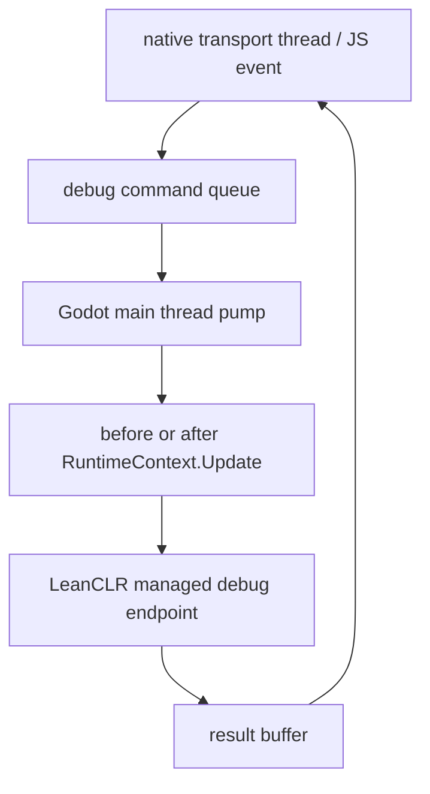

# LeanCLR Godot Integration Plan

本文记录 NKGGameFramework 接入 LeanCLR 与 Godot 的实施计划。核心原则是：NKG 的游戏运行时和调试领域模型继续运行在 managed/LeanCLR 内，Godot 侧只负责生命周期、宿主服务和 transport；不要用 GDScript 重写 NKG，也不要依赖 Godot 官方 C#/.NET 扩展作为主路径。

## Goals

- 在 Godot desktop、mobile、web 目标上通过 LeanCLR 执行 NKG managed assemblies。
- 保持 `NKGGameFramework` 主包不依赖 Godot、GDScript、GDExtension 或 Web 前端。
- Godot 官方 C#/.NET 扩展不是主路径，避免 Web 和移动端导出能力被其平台支持状态限制。
- GDScript 只作为启动、编辑器配置和可选 facade，不承载 ECS、Gameplay、NodeGraph、Serialization 或 Debug 领域逻辑。
- WebDebug 保留 snapshot、mutation、dump、pause/step/frame stream 等调试语义，但不要求 LeanCLR 实现 `System.Net`、HTTP、SSE 或 WebSocket server。
- Godot 用户安装 `leanclr-godot` 插件后获得默认 debug transport，不需要项目业务层再手写 debug bridge。

## Non-Goals

- 不实现 GodotSharp 的完整替代层。
- 不把 Godot 全 API 暴露给 C# 业务层。
- 不把 NKG runtime 或业务逻辑迁移到 GDScript。
- 不在 LeanCLR Core 路径补齐 ASP.NET、HTTP server、SSE 或完整网络 BCL。
- 不让 native/Godot/JS 理解 ECS 组件结构、Odin payload 或 structured tree。

## Target Shape

```text
Godot Scene / GDScript Autoload
  -> leanclr-godot GDExtension or native module
     -> LeanCLR runtime
        -> NKGGameFramework managed assemblies
```

Godot 侧只提供宿主能力：

- 加载 LeanCLR runtime、managed assemblies 和配置资源。
- 把 Godot `_process` / `_physics_process` 转成 NKG `RuntimeContext.Update`。
- 提供最小 host services：log、time、input、asset、scene、audio、ui binding、persistence。
- 承载 debug transport：desktop loopback、outbound WebSocket、Web JS bridge 或 dump 文件传输。

Managed/LeanCLR 侧继续拥有：

- `RuntimeContext` / `World` / `Scene` / ECS / Gameplay / Nodes。
- `GameDebugSession`、snapshot、mutation、dump、pause/step 控制。
- 组件值 payload 和 structured 序列化。
- mutation 的反序列化、类型解析和 ECS 写回。

## Package Boundaries

轻量 debug control/frame/snapshot DTO 放在 `NKGGameFramework` 核心包中，供 LeanCLR/Godot 直接复用框架定义；`NKGGameFramework.Diagnostics` 保留完整 snapshot provider、mutation、dump、analysis 和 transport-independent WebDebug endpoint dispatcher；`NKGGameFramework.Hosting` 保留为 HTTP/SSE transport 包。LeanCLR/Godot 可以引用 Diagnostics 获得完整 WebDebug 领域能力，但不应把 Hosting 的 managed socket/HTTP/SSE transport 带入启动路径。

| Package | Responsibility | LeanCLR target |
| --- | --- | --- |
| `NKGGameFramework` | 引擎无关 runtime、ECS、Gameplay、Nodes、Serialization、Runtime contracts、debug control/frame/snapshot DTO | 必选 |
| `NKGGameFramework.Adapter.Godot` | managed contracts，定义 Godot 宿主服务抽象，不引用 GodotSharp | 必选 |
| `NKGGameFramework.Diagnostics` | 完整 snapshot provider、mutation、dump、analysis、WebDebug endpoint dispatcher、后续 debug command API | 桌面样例启用完整 WebDebug 领域能力；移动/Web 按 BCL profile 裁剪 transport |
| `NKGGameFramework.Hosting` | loopback HTTP/SSE 默认桌面 transport | 可选，LeanCLR Web/mobile 不启用 |
| `leanclr-godot` | GDExtension/native runtime loader、host bridge、Godot transport | 必选 |
| `NKGGameFramework.Hosting.Web` | React/Vite WebDebug 面板 | 工具链可选，运行时不进 LeanCLR |

基础包拆分完成后，`GameDebugHost` 内的 endpoint dispatch 已先抽成 transport-independent dispatcher，让 Godot native transport 不必引用 Hosting 或 managed sockets。后续可继续把 HTTP path/query adapter 再下沉为 command API，服务 WebSocket、JS bridge 和移动端 outbound transport。

## Debug Boundary

### Keep In Managed/LeanCLR

这些逻辑必须留在 managed 侧，因为它们需要访问 NKG runtime、ECS 类型系统、组件值和序列化策略：

- `GameDebugSession`
- `IGameDebugSnapshotProvider` / `GameDebugSnapshotProvider`
- `IGameDebugMutationHandler` / `GameDebugMutationHandler`
- `IGameDebugComponentValueSerializer`
- `GameDebugDumpRecorder`、dump document、playback、analysis domain
- `GameDebugController`、`GameDebugFramePublisher`
- `GameDebugSnapshotCaptureOptions`、mutation request/result、control request/result

### Move Out Of LeanCLR Runtime Requirement

这些是 transport，不应成为 LeanCLR Web/mobile 的实现负担：

- `TcpListener` / `TcpClient` / `NetworkStream`
- HTTP request parser、header、CORS、chunked body、endpoint path/query parser
- SSE framing
- WebSocket server/client 具体实现
- Godot Web JS bridge / `postMessage`
- debug UI 页面托管
- 端口管理和浏览器打开逻辑

Desktop 开发场景仍可使用 HTTP/SSE transport，但它应是一个可选 transport，而不是 LeanCLR 接入的基础能力。

## Debug Command API

LeanCLR/Godot 之间建议使用 command API，而不是把 HTTP endpoint 直接暴露进 managed runtime。

```text
native transport request
  -> DebugCommand + body bytes
     -> LeanCLR managed debug endpoint
        -> snapshot / control / mutation / dump operation
           -> utf8 json bytes or binary bytes
              -> native transport response
```

推荐最小命令：

| Command | Input | Output |
| --- | --- | --- |
| `health` | empty | health JSON |
| `snapshot` | `GameDebugSnapshotCaptureOptions` JSON | `GameDebugSnapshotMessage` JSON |
| `stream.poll` | light snapshot options | next frame JSON or empty |
| `control.get` | empty | control state JSON |
| `control.execute` | `GameDebugControlRequest` JSON | control state/result JSON |
| `mutation.apply` | `GameDebugMutationRequest` JSON | `GameDebugMutationResult` JSON |
| `dump.recording.get` | empty | recording state JSON |
| `dump.recording.execute` | recording request JSON | recording state/result JSON |
| `dump.playback.open` | dump bytes or path token | playback manifest JSON |
| `dump.playback.frame` | playback frame request JSON | frame JSON |
| `dump.playback.component` | component detail request JSON | component detail JSON |
| `dump.analysis` | dump bytes or path token | analysis report JSON |

Native/Godot 负责把 HTTP path、WebSocket message 或 JS event 转换成 command。Managed 侧不关心请求来自 HTTP、WebSocket、JS bridge 还是测试 harness。

## Native ABI Sketch

实际 ABI 以 `leanclr-godot` 的 host bridge 能力为准。建议先走 opaque buffer，避免 native 解析 managed DTO。

```c
typedef struct nkg_debug_buffer {
    const uint8_t* data;
    int32_t length;
} nkg_debug_buffer;

int32_t nkg_debug_execute(
    const char* command,
    const uint8_t* body,
    int32_t body_length,
    nkg_debug_buffer* output);

void nkg_debug_release(nkg_debug_buffer buffer);
```

约束：

- `command` 是稳定 ASCII 标识，例如 `snapshot`、`mutation.apply`。
- `body` 是 UTF-8 JSON 或二进制 dump payload。
- `output` 由 LeanCLR/managed 侧生成，native 发送后必须释放。
- native 不解析 ECS/component/payload/structured，只透传 output。
- command 执行必须经过主线程调度，不允许网络线程直接读写 NKG runtime。

如果 LeanCLR 当前不适合直接暴露 managed allocated buffer，可以由 native 传入 reusable output buffer 或通过 host bridge 提供 copy-out API。

## Main Thread Scheduling

Snapshot 和 mutation 必须在 NKG/Godot 主线程或框架安全点执行，避免 debug transport 线程和游戏 update 并发读写同一份 ECS 状态。

推荐调度模型：



安全点：

- `RuntimeContext.Update` 前后可以执行 snapshot。
- mutation 默认要求 paused 且没有 pending step。
- frame stream 只发布 `RuntimeContext.Update` 边界的 frame，不把 `World.Update` 或 `Scene.Update` 当作外部步进点。
- 如果 transport 支持异步等待，命令可以排队到下一帧返回；如果 transport 是 JS 同步调用，应只允许轻量状态查询或返回 pending token。

已有 `IGameDebugScheduler` 思路可以复用：desktop inline scheduler 保持现有测试便利，Godot scheduler 通过主线程 pump 执行。

## Transport Variants

### Desktop / Editor

首选方案：

- 由 `leanclr-godot` native transport 起 loopback HTTP/SSE 或 outbound WebSocket。
- HTTP endpoint 兼容现有 WebDebug 前端的 `/_nkg/debug/*` API。
- 请求进入 native 后转成 debug command，再调 LeanCLR managed endpoint。

备选方案：

- 保留当前 managed `GameDebugHost`，仅在 LeanCLR BCL 和平台成本允许时启用。
- 这不作为 Godot Web/mobile 的依赖。

### Mobile

推荐 outbound transport：

- 游戏作为 WebSocket client 连接桌面调试工具。
- 桌面工具发 debug command，移动端返回 JSON/binary result。
- 不依赖手机端监听端口，也不要求移动端内置 HTTP server。

兜底：

- 支持录制 `.nkgdump` 并通过平台文件分享或开发工具拉取。

### Web

不在 wasm 内实现 HTTP server。

推荐方案：

- Godot Web custom HTML shell 同时加载游戏和 WebDebug bundle。
- WebDebug 通过 JS bridge / `postMessage` / Emscripten exported function 发送 debug command。
- Godot/LeanCLR 返回 JSON/binary buffer，WebDebug 直接渲染。

备选方案：

- Godot Web 游戏作为 WebSocket client 连接外部开发服务。
- 外部服务托管 WebDebug UI，并把 command 转发给游戏页面。

Web transport 应复用同一套 command payload，不为 Web 单独发明 snapshot 格式。

## GDScript Role

GDScript 只做薄层：

- `addons/nkg_leanclr/NkgRuntime.gd` autoload。
- Runtime 配置资源：managed assembly 路径、AOT data 路径、debug 开关、transport 模式。
- Godot editor plugin：菜单、导入、构建检查、导出模板提示。
- 可选 generated facade：把常用 managed entry 映射成 Godot 友好的调用点。

GDScript 不做：

- ECS 数据结构。
- Skill/Buff/BehaviorTree 执行。
- NodeGraph 运行时。
- 组件序列化或 mutation materialization。
- WebDebug snapshot 组装。

## Implementation Phases

### Phase 1: LeanCLR Runtime Loop Smoke

- 在 `leanclr-godot` 中启动 LeanCLR runtime。
- 加载 NKG managed assemblies。
- 创建一个 Godot `NkgRuntimeNode`。
- `_process` 调用 managed entry，并推进 `RuntimeContext.Update`。
- 先跑通不依赖 WebDebug transport 的 sampler。

Acceptance:

- Desktop Godot 能启动、update、退出。
- Managed log 能回到 Godot console。
- sampler frame count 和 delta time 行为可验证。

### Phase 2: Minimal Host Services

- 提供 log、time、input、asset path、scene load、save path。
- `NKGGameFramework.Adapter.Godot` 只保留 managed contracts。
- concrete service 实现在 `leanclr-godot` native/GDScript 层。

Acceptance:

- managed 业务不引用 GodotSharp。
- NKG sampler 能通过 host services 访问基本资源和场景能力。
- Web/mobile 编译时不引入 Godot 官方 C# 扩展。

### Phase 3: Debug Endpoint Split

- `NKGGameFramework.Diagnostics` 已承载 snapshot、mutation、dump、control 等领域类型。
- 从 `GameDebugHost` 中抽出 transport-independent WebDebug endpoint dispatcher。
- `snapshot`、`control`、`mutation`、`dump` 操作可以在没有 HTTP server 的情况下被调用。
- `GameDebugJson` 和 LeanCLR-safe DTO writer 明确归属 debug domain。
- 保留现有 HTTP/SSE 行为作为一个 adapter。

Acceptance:

- 现有 WebDebug HTTP tests 继续通过。
- 新增 dispatcher-level tests，不启动 `TcpListener` 也能 capture snapshot、apply mutation、record/analyze/open dump。
- Godot/LeanCLR bridge 复用 Diagnostics dispatcher，不重写 WebDebug DTO 或业务协议。

### Phase 4: Godot Desktop Debug Transport

- 在 `leanclr-godot` 中实现 desktop transport。
- 初期可用 loopback HTTP/SSE 兼容现有 WebDebug UI。
- 请求进入 native 后透传 method/target/body，再调 LeanCLR managed endpoint dispatcher。
- 所有 debug command 经主线程 scheduler 执行。

Acceptance:

- Godot desktop 运行时能被现有 WebDebug UI 查看。
- pause/step 仍以 `RuntimeContext.Update` 为唯一外部步进边界。
- mutation 在 paused 状态下可写回 ECS。
- dump recording、analysis、playback 和 binary upload 在 native HTTP 到 LeanCLR 的端到端 smoke 中通过。

### Phase 5: Godot Web Debug Transport

- Godot Web custom shell 加载 WebDebug bundle。
- JS bridge 把 WebDebug operation 转成 debug command。
- managed endpoint 返回 JSON/binary buffer。
- 不启用 HTTP server。

Acceptance:

- Web build 中能查看 live summary。
- 按需 component detail 能返回 payload/structured。
- pause/step/control 可用。
- 不要求 LeanCLR 支持 `System.Net` server API。

### Phase 6: Mobile Transport And Dump Fallback

- 实现 outbound WebSocket client 或平台开发工具通道。
- 支持 `.nkgdump` 导出、分享或拉取。
- 移动端不监听端口。

Acceptance:

- 真机可以连接桌面 debug tool。
- 断连时不影响游戏主循环。
- dump fallback 能离线打开和分析。

## Verification Matrix

| Scenario | Required checks |
| --- | --- |
| Desktop Godot runtime | startup, update loop, log bridge, clean shutdown |
| Desktop debug HTTP | health, snapshot, stream, control, mutation, dump |
| Web runtime | LeanCLR load, sampler update, JS bridge availability |
| Web debug | live summary, component detail, pause/step, no HTTP server |
| Mobile runtime | startup, update, log, no inbound listener |
| Mobile debug | outbound connect, command roundtrip, dump fallback |
| Existing .NET host | current tests remain green |
| Existing WebDebug UI | HTTP transport remains compatible |

## Risks

- Godot Web GDExtension packaging requires custom export template and extension support;需要在 `leanclr-godot` 的构建链中固化。
- LeanCLR 的 JSON/BCL 支持可能不足以直接使用 `System.Text.Json`；必要时 debug command API 使用专用轻量 JSON writer 或 Odin JSON。
- Native/managed buffer ownership 容易出错；必须有明确 release 约定和压力测试。
- Debug command 主线程调度可能引入异步响应复杂度；需要 command id、pending token 或 future 机制。
- WebDebug 前端当前假设 HTTP endpoint；Web transport 需要一个 API client adapter，保持 payload 不变，只替换 transport。

## Open Decisions

- Godot desktop transport 首版使用 native HTTP/SSE 还是 outbound WebSocket。
- 后续 command API 是否保留 HTTP target 兼容层，还是完全改为 command id + body。
- LeanCLR 侧 JSON 输出当前使用固定 DTO writer；后续是否替换成更完整的轻量 JSON writer 仍待评估。
- WebDebug 前端是否引入 `DebugTransport` 抽象，统一 HTTP、WebSocket、JS bridge。
- `.nkgdump` 在 Web/mobile 上的存储、导出和上传路径。

## First Milestone

第一阶段目标用于验证运行时边界正确：

1. Godot desktop 能通过 GDExtension 启动 LeanCLR。
2. NKG sampler 能在 Godot `_process` 驱动下运行。
3. `RuntimeContext.Update` 成为唯一 debug frame 边界。
4. `GameDebugSnapshotProvider.Capture` 能通过 command API 返回 JSON。
5. 整个过程不需要 Godot 官方 C# 扩展，也不需要 LeanCLR 实现 HTTP server。
